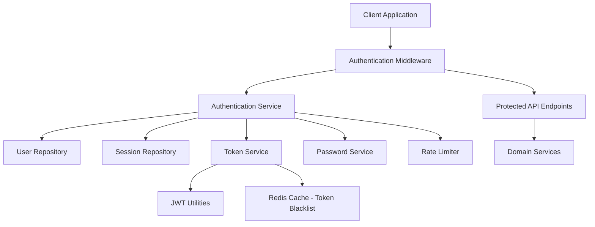
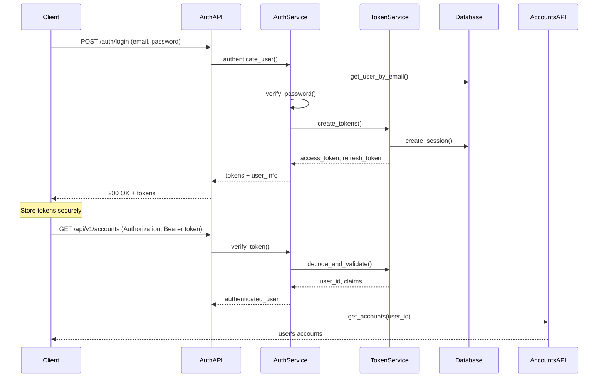

# Authentication System Design Document

## Overview

The authentication system will implement JWT-based authentication with refresh tokens, role-based access control, and comprehensive security features for the Better Call Buffet API. The design leverages the existing users domain and extends it with authentication-specific functionality while maintaining the established domain-driven architecture pattern.

The system will use industry-standard security practices including password hashing with bcrypt, JWT tokens with RS256 signing, rate limiting, and secure session management. All authentication flows will be designed to prevent common security vulnerabilities like timing attacks, token replay, and session fixation.

## Architecture

### High-Level Architecture



### Authentication Flow



## Components and Interfaces

### 1. Authentication Domain Structure

```
app/domains/auth/
├── __init__.py
├── models.py          # Session, PasswordReset models
├── schemas.py         # Request/Response schemas
├── service.py         # Authentication business logic
├── repository.py      # Auth-specific data access
├── router.py          # Authentication endpoints
├── dependencies.py    # FastAPI dependencies
├── exceptions.py      # Auth-specific exceptions
└── utils/
    ├── __init__.py
    ├── password.py    # Password hashing utilities
    ├── tokens.py      # JWT token utilities
    └── rate_limit.py  # Rate limiting utilities
```

### 2. Core Models

#### Extended User Model
```python
# Extend existing app/domains/users/models.py
class User(Base):
    # ... existing fields ...
    role = Column(Enum(UserRole), default=UserRole.USER, nullable=False)
    failed_login_attempts = Column(Integer, default=0, nullable=False)
    locked_until = Column(DateTime, nullable=True)
    last_login = Column(DateTime, nullable=True)
    password_changed_at = Column(DateTime, default=datetime.utcnow, nullable=False)
```

#### Session Model
```python
class Session(Base):
    __tablename__ = "sessions"
    
    id = Column(UUID(as_uuid=True), primary_key=True, default=uuid.uuid4)
    user_id = Column(UUID(as_uuid=True), ForeignKey("users.id"), nullable=False)
    refresh_token_hash = Column(String, nullable=False)
    device_info = Column(String, nullable=True)
    ip_address = Column(String, nullable=True)
    user_agent = Column(String, nullable=True)
    created_at = Column(DateTime, default=datetime.utcnow, nullable=False)
    last_used = Column(DateTime, default=datetime.utcnow, nullable=False)
    expires_at = Column(DateTime, nullable=False)
    is_active = Column(Boolean, default=True, nullable=False)
```

#### Password Reset Model
```python
class PasswordReset(Base):
    __tablename__ = "password_resets"
    
    id = Column(UUID(as_uuid=True), primary_key=True, default=uuid.uuid4)
    user_id = Column(UUID(as_uuid=True), ForeignKey("users.id"), nullable=False)
    token_hash = Column(String, nullable=False)
    created_at = Column(DateTime, default=datetime.utcnow, nullable=False)
    expires_at = Column(DateTime, nullable=False)
    used_at = Column(DateTime, nullable=True)
```

### 3. Authentication Service Interface

```python
class AuthService:
    async def register_user(self, user_data: UserRegistration) -> User
    async def authenticate_user(self, email: str, password: str) -> AuthResult
    async def refresh_tokens(self, refresh_token: str) -> TokenPair
    async def logout(self, refresh_token: str) -> None
    async def logout_all_sessions(self, user_id: UUID) -> None
    async def request_password_reset(self, email: str) -> None
    async def reset_password(self, token: str, new_password: str) -> None
    async def change_password(self, user_id: UUID, old_password: str, new_password: str) -> None
    async def get_user_sessions(self, user_id: UUID) -> List[SessionInfo]
    async def revoke_session(self, user_id: UUID, session_id: UUID) -> None
```

### 4. Token Service Interface

```python
class TokenService:
    def create_access_token(self, user_id: UUID, role: UserRole) -> str
    def create_refresh_token(self, user_id: UUID, session_id: UUID) -> str
    def decode_access_token(self, token: str) -> TokenPayload
    def decode_refresh_token(self, token: str) -> RefreshTokenPayload
    async def is_token_blacklisted(self, jti: str) -> bool
    async def blacklist_token(self, jti: str, expires_at: datetime) -> None
```

### 5. Authentication Dependencies

```python
# FastAPI dependencies for route protection
async def get_current_user(token: str = Depends(oauth2_scheme)) -> User
async def get_current_active_user(current_user: User = Depends(get_current_user)) -> User
async def require_role(required_role: UserRole) -> Callable
async def get_optional_user(token: Optional[str] = Depends(optional_oauth2_scheme)) -> Optional[User]
```

## Data Models

### JWT Token Structure

#### Access Token Payload
```json
{
  "sub": "user_id",
  "email": "user@example.com",
  "role": "user",
  "iat": 1640995200,
  "exp": 1640996100,
  "jti": "unique_token_id",
  "type": "access"
}
```

#### Refresh Token Payload
```json
{
  "sub": "user_id",
  "session_id": "session_uuid",
  "iat": 1640995200,
  "exp": 1641600000,
  "jti": "unique_token_id",
  "type": "refresh"
}
```

### API Request/Response Schemas

#### Registration Request
```python
class UserRegistration(BaseModel):
    email: EmailStr
    password: str = Field(..., min_length=8, max_length=128)
    full_name: Optional[str] = Field(None, max_length=255)
    
    @validator('password')
    def validate_password_strength(cls, v):
        # Implement password strength validation
        return v
```

#### Login Request/Response
```python
class LoginRequest(BaseModel):
    email: EmailStr
    password: str

class LoginResponse(BaseModel):
    access_token: str
    refresh_token: str
    token_type: str = "bearer"
    expires_in: int
    user: UserProfile
```

### Database Schema Changes

#### Users Table Extensions
```sql
ALTER TABLE users 
ADD COLUMN role VARCHAR(20) DEFAULT 'user' NOT NULL,
ADD COLUMN failed_login_attempts INTEGER DEFAULT 0 NOT NULL,
ADD COLUMN locked_until TIMESTAMP NULL,
ADD COLUMN last_login TIMESTAMP NULL,
ADD COLUMN password_changed_at TIMESTAMP DEFAULT CURRENT_TIMESTAMP NOT NULL;

CREATE INDEX ix_users_role ON users(role);
CREATE INDEX ix_users_locked_until ON users(locked_until);
```

## Error Handling

### Authentication Error Hierarchy

```python
class AuthException(AppException):
    """Base authentication exception"""
    pass

class InvalidCredentialsError(AuthException):
    """Invalid email or password"""
    status_code = 401
    error_code = "INVALID_CREDENTIALS"

class AccountLockedError(AuthException):
    """Account temporarily locked due to failed attempts"""
    status_code = 423
    error_code = "ACCOUNT_LOCKED"

class TokenExpiredError(AuthException):
    """JWT token has expired"""
    status_code = 401
    error_code = "TOKEN_EXPIRED"

class InsufficientPermissionsError(AuthException):
    """User lacks required permissions"""
    status_code = 403
    error_code = "INSUFFICIENT_PERMISSIONS"
```

### Error Response Format

```json
{
  "error": {
    "code": "INVALID_CREDENTIALS",
    "message": "Invalid email or password",
    "details": null,
    "timestamp": "2024-01-01T12:00:00Z",
    "request_id": "req_123456"
  }
}
```

## Testing Strategy

### Unit Testing Approach

1. **Service Layer Tests**
   - Authentication logic (login, registration, password reset)
   - Token generation and validation
   - Password hashing and verification
   - Rate limiting functionality

2. **Repository Layer Tests**
   - User CRUD operations
   - Session management
   - Password reset token handling

3. **Utility Tests**
   - JWT token creation and parsing
   - Password strength validation
   - Rate limiting algorithms

### Integration Testing

1. **API Endpoint Tests**
   - Registration flow with validation
   - Login/logout flows
   - Token refresh mechanisms
   - Password reset workflows
   - Protected endpoint access

2. **Middleware Tests**
   - Authentication middleware behavior
   - Rate limiting middleware
   - CORS handling with authentication

3. **Database Integration Tests**
   - User creation and retrieval
   - Session lifecycle management
   - Token blacklisting functionality

### Security Testing

1. **Authentication Security Tests**
   - Brute force protection
   - Token replay attack prevention
   - Session fixation protection
   - Password timing attack prevention

2. **Authorization Tests**
   - Role-based access control
   - Resource ownership validation
   - Privilege escalation prevention

### Test Data Management

```python
# Test fixtures for authentication testing
@pytest.fixture
async def test_user():
    return await create_test_user(
        email="test@example.com",
        password="TestPassword123!",
        role=UserRole.USER
    )

@pytest.fixture
async def admin_user():
    return await create_test_user(
        email="admin@example.com", 
        password="AdminPassword123!",
        role=UserRole.ADMIN
    )

@pytest.fixture
async def authenticated_client(test_user):
    tokens = await auth_service.authenticate_user(
        test_user.email, "TestPassword123!"
    )
    return TestClient(app, headers={
        "Authorization": f"Bearer {tokens.access_token}"
    })
```

## Security Considerations

### Token Security
- Use RS256 algorithm for JWT signing
- Implement token rotation for refresh tokens
- Maintain token blacklist for logout functionality
- Set appropriate token expiration times (15 min access, 7 days refresh)

### Password Security
- Use bcrypt with minimum 12 rounds for password hashing
- Implement password strength requirements
- Prevent password reuse (store hash of last 5 passwords)
- Secure password reset with time-limited tokens

### Rate Limiting
- Implement progressive delays for failed login attempts
- Account lockout after 5 failed attempts within 15 minutes
- API rate limiting per user/IP address
- Separate rate limits for sensitive endpoints

### Session Management
- Track active sessions with device/location info
- Automatic session cleanup for inactive sessions
- Session revocation on password change
- Secure session storage with encrypted refresh tokens

## Configuration

### Environment Variables
```bash
# JWT Configuration
JWT_SECRET_KEY=your-secret-key-here
JWT_ALGORITHM=RS256
JWT_ACCESS_TOKEN_EXPIRE_MINUTES=15
JWT_REFRESH_TOKEN_EXPIRE_DAYS=7

# Security Configuration
PASSWORD_MIN_LENGTH=8
MAX_LOGIN_ATTEMPTS=5
ACCOUNT_LOCKOUT_DURATION_MINUTES=30
RATE_LIMIT_PER_MINUTE=60

# Redis Configuration (for token blacklist)
REDIS_URL=redis://localhost:6379/0
```

### Security Headers
```python
# Add security headers middleware
app.add_middleware(
    SecurityHeadersMiddleware,
    headers={
        "X-Content-Type-Options": "nosniff",
        "X-Frame-Options": "DENY",
        "X-XSS-Protection": "1; mode=block",
        "Strict-Transport-Security": "max-age=31536000; includeSubDomains",
    }
)
```