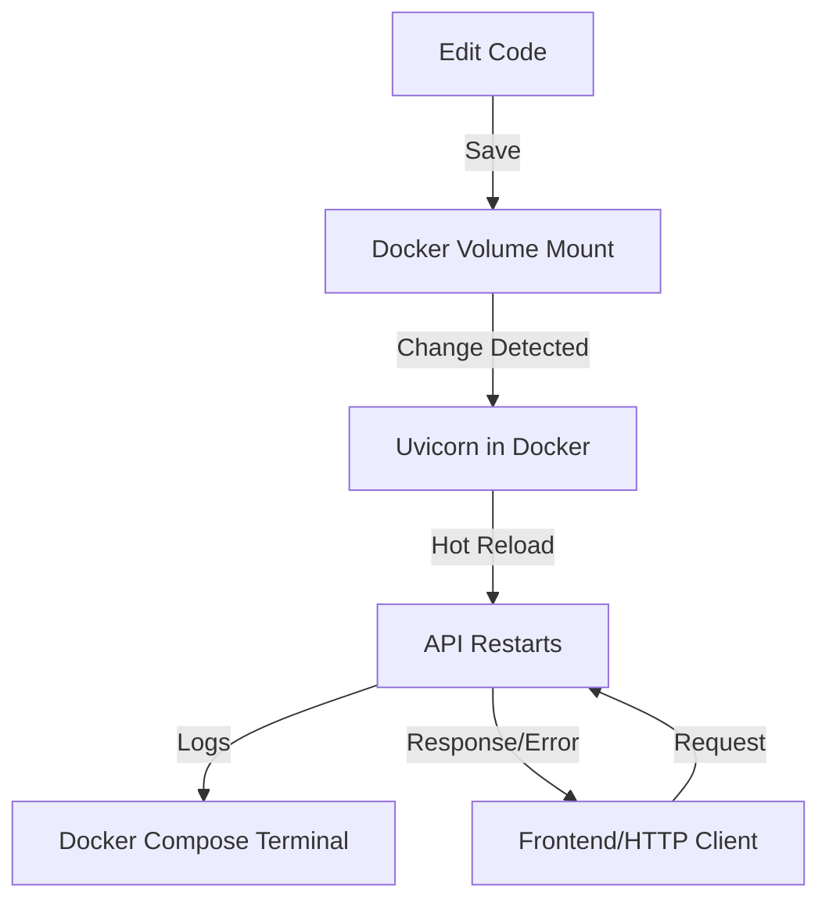
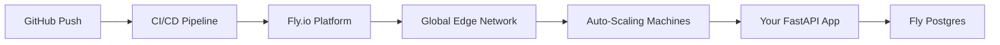

# Better Call Buffet

## 🚀 Developer Onboarding: The Golden Path for Local Development

Welcome to the Better Call Buffet project! This section will guide you through the ideal developer experience (DX) for starting, developing, and stopping the API—leveraging Docker for consistency, hot reload, and productivity.

### Why Docker?

- **Consistency:** Everyone runs the same environment—no more "works on my machine."
- **Simplicity:** One command starts everything (API + database).
- **Isolation:** No need to install Python, Poetry, or Postgres locally.
- **Production Parity:** Your local setup matches production, reducing surprises.

---

### 🏁 Prerequisites

- **Docker & Docker Compose** must be installed.
  - [Install Docker Desktop](https://www.docker.com/products/docker-desktop/) (includes Compose)

---

### ▶️ Quick Start Cheat Sheet

| Action         | Command                                      | What Happens?                   |
| -------------- | -------------------------------------------- | ------------------------------- |
| Start API & DB | `docker-compose up`                          | Hot reload, logs, DB all in one |
| Stop API & DB  | `Ctrl+C` or `docker-compose down`            | Clean shutdown                  |
| Run migrations | `docker-compose exec web alembic ...`        | DB schema updated               |
| Run tests      | `docker-compose exec web poetry run pytest`  | Tests run inside container      |
| Format code    | `docker-compose exec web poetry run black .` | Code formatted inside container |

---

### 🌊 Visual Workflow Diagram



---

### 🏆 Best Practices

- **Always use Docker Compose** for local development.
- **Never use `--reload` in production** (for security/performance).
- **Check logs** in your terminal for errors and debugging.
- **Use the provided commands** for migrations, testing, and formatting.

---

### 📚 Further Reading

- [Fly.io Deployment Guide](docs/guides/fly-io-deployment-guide.md)

---

## The Golden Path: Standardized Development with Docker

To ensure a consistent, predictable, and productive development environment for every engineer, this project uses **Docker as the single, required standard for local development.**

### Why Docker?

- **Consistency:** Eliminates "it works on my machine" problems by ensuring everyone runs the exact same environment, from dependencies to database versions.
- **Simplicity:** Get a fully running application and database with a single command (`docker-compose up`). No need to install and configure PostgreSQL or Python locally.
- **Isolation:** Keeps your local machine clean. All project dependencies are managed inside containers and won't conflict with other projects.
- **Production Parity:** Our local setup mirrors the containerized environment used in production, reducing surprises during deployment.

---

## 🚀 **Serverless Architecture with Fly.io**

### **🎓 Understanding Your Production Setup**

Your Better Call Buffet application runs on **Fly.io's distributed serverless platform** with automatic scaling, edge deployment, and zero-downtime deployments - all without managing any servers!

**📚 [Fly.io Deployment Guide](docs/guides/fly-io-deployment-guide.md)**

**What you get automatically:**

- ✅ **Global edge deployment** (apps run close to users worldwide)
- ✅ **Automatic scaling** (scale to zero when not in use)
- ✅ **Zero-downtime deployments** (rolling deployments with health checks)
- ✅ **Built-in load balancing** (requests distributed intelligently)
- ✅ **Cost optimization** (pay only for what you use)

**Current monthly cost:** ~$0-10 (scales with usage, generous free tier)

### **🏗️ Production Architecture**



**Companies using similar architecture:** Discord, Bluesky, Supabase

---

## Local Development Setup

### Prerequisites

- **Docker & Docker Compose:** Must be installed on your system.
  - [Install Docker Desktop](https://www.docker.com/products/docker-desktop/) (includes Docker Compose)

### Running the Application

1.  **Clone the repository.**
2.  **Navigate to the project root directory.**
3.  **Start the services:**

    ```bash
    docker-compose up -d --build
    ```

That's it. The application stack is now running.

- **API URL:** [http://localhost:8000](http://localhost:8000)
- **Interactive API Docs (Swagger):** [http://localhost:8000/docs](http://localhost:8000/docs)
- **Database:** A PostgreSQL instance is running and exposed on `localhost:5432`. You can connect to it with the credentials in `docker-compose.yml`.

### Stopping the Application

To stop the running containers, execute:

```bash
docker-compose down
```

---

## Common Development Tasks

All commands should be executed from your host machine's terminal in the project root.

### Working with Database Migrations

As you develop new features, you will often need to modify the database schema. This is handled by `Alembic`. Here are the essential commands for your daily work.

**Applying Migrations**

To apply all outstanding migrations and bring the database up to the latest version, run:

```bash
docker-compose exec web alembic upgrade head
```

**Creating a New Migration**

After you have changed your SQLAlchemy models (e.g., in `app/domains/.../models.py`), you need to generate a new migration script. Alembic can often detect these changes automatically.

```bash
docker-compose exec web alembic revision --autogenerate -m "A short, descriptive message about your changes"
```

- `--autogenerate`: Tells Alembic to compare your models to the current database state and generate the migration code.
- `-m "..."`: Provides a message that will become part of the migration file name. Always use a descriptive message!

After running this, a new migration file will appear in the `migrations/versions/` directory. You should always inspect this file to ensure it's correct before committing it.

**Checking the Current Status**

To see the current revision of your database, use:

```bash
docker-compose exec web alembic current
```

This is useful to confirm that your migrations have been applied correctly.

### Running Tests

Execute the `pytest` suite inside the `web` container:

```bash
docker-compose exec web poetry run pytest
```

### Code Formatting & Linting

Run the formatters and linters inside the `web` container:

```bash
# Run Black for formatting
docker-compose exec web poetry run black .
```

---

## Project Structure

```
better-call-buffet/
├── app/
│ ├── api/ # API endpoints
│ ├── core/ # Core functionality
│ ├── db/ # Database models and config
│ └── domains/ # Business logic domains
├── docs/ # Documentation
├── migrations/ # Alembic database migrations
└── docker-compose.yml # Defines the local development environment
```

## Contributing

1. Create a feature branch.
2. Make your changes inside the containerized environment.
3. Run tests: `docker-compose exec web poetry run pytest`
4. Format code: `docker-compose exec web poetry run black .`
5. Submit a pull request.

## CI/CD Pipeline

This project uses an automated CI/CD pipeline powered by GitHub Actions. The pipeline includes:

- **Code Quality Checks**: Automated linting, formatting, and type checking.
- **Security Scanning**: Dependency vulnerability detection.
- **Docker Build**: Containerized application building and testing.
- **Automated Deployment**: Production deployment to Fly.io.

### 📚 Documentation

- **[Fly.io Deployment Guide](docs/guides/fly-io-deployment-guide.md)** - Complete guide to deploying on Fly.io.

---

## Architecture

```
┌─────────────────────────────────────┐
│  🌐 ROUTER LAYER (HTTP Concerns)     │
│  - Request/Response formatting       │
│  - HTTP status codes                 │
│  - Pydantic validation               │
│  - API versioning                    │
└─────────────────────────────────────┘
                   ↓
┌─────────────────────────────────────┐
│  💼 SERVICE LAYER (Business Logic)   │
│  - Domain operations                 │
│  - Business rules                    │
│  - Data validation                   │
│  - Returns domain models             │
└─────────────────────────────────────┘
                   ↓
┌─────────────────────────────────────┐
│  🗄️ DATA LAYER (Persistence)        │
│  - Database queries                  │
│  - SQLAlchemy models                 │
│  - Transaction management            │
└─────────────────────────────────────┘
```

## 📚 Documentation

### Core Development Guides

- **[Fly.io Deployment Guide](docs/guides/fly-io-deployment-guide.md)** - Complete guide to deploying on Fly.io

## License

[License details here]
