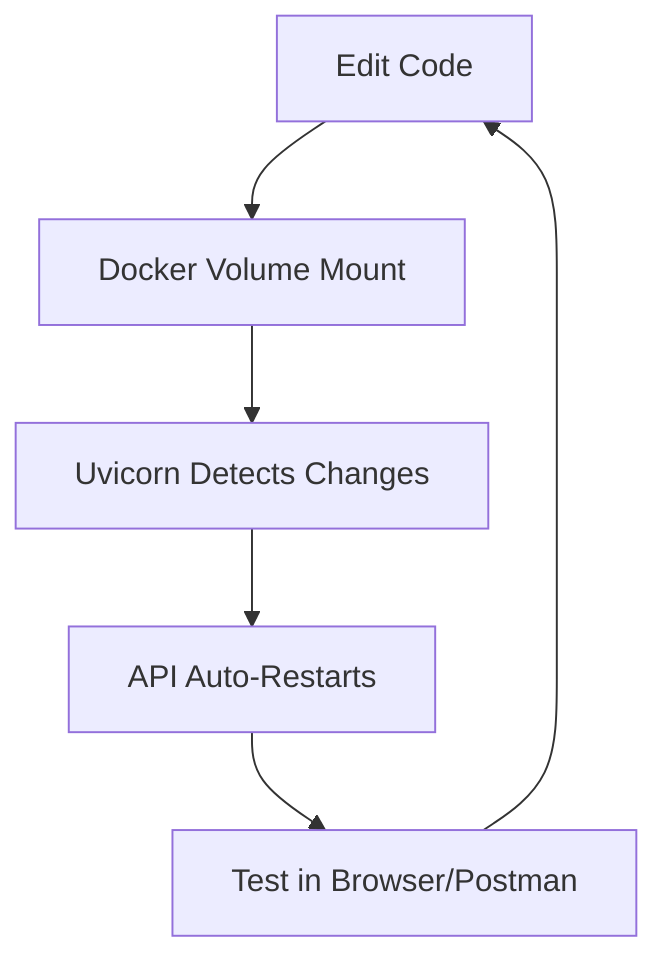
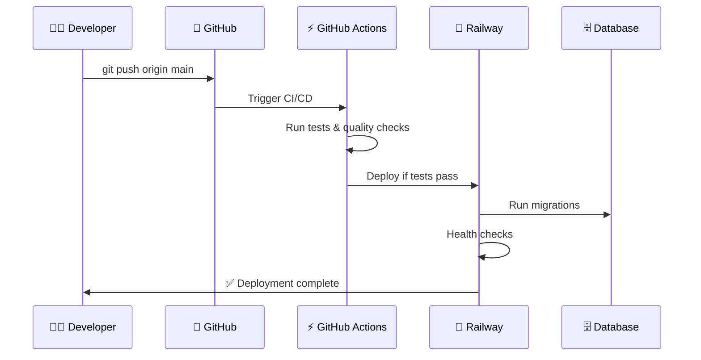

# Better Call Buffet

**A modern financial management and analysis platform** built with FastAPI, featuring AI-powered insights, comprehensive transaction tracking, and professional-grade architecture.

## 🎯 **What is Better Call Buffet?**

Better Call Buffet is a **personal finance platform** that helps you manage your financial life with the sophistication of professional investment tools. Think of it as your personal financial command center with AI assistance.

### **Core Capabilities**
- 📊 **Multi-Account Management** - Track bank accounts, investments, and credit cards
- 💳 **Transaction Analytics** - Categorize and analyze spending patterns
- 🤖 **AI-Powered Insights** - Smart financial analysis and recommendations
- 📈 **Investment Tracking** - Monitor brokers and portfolio performance
- 📋 **Statement Processing** - Import and parse financial statements
- 📊 **Custom Reports** - Generate detailed financial analytics

---

## 🚀 **Quick Start - Developer Onboarding**

Welcome to the golden path for local development! This section will get you up and running in minutes.

### **🏁 Prerequisites**

- **Docker & Docker Compose** must be installed
  - [Install Docker Desktop](https://www.docker.com/products/docker-desktop/) (includes Compose)

### **▶️ Getting Started**

```bash
# 1. Clone the repository
git clone <repository-url>
cd better-call-buffet

# 2. Start everything with one command
docker-compose up -d --build

# 3. Run database migrations
docker-compose exec web alembic upgrade head

# 4. Visit your API
open http://localhost:8000/docs
```

**That's it!** 🎉 Your financial platform is now running.

### **📍 Local URLs**
- **API:** http://localhost:8000
- **Interactive Docs:** http://localhost:8000/docs
- **Health Check:** http://localhost:8000/health

### **▶️ Development Cheat Sheet**

| Action | Command | What Happens? |
|--------|---------|---------------|
| Start API & DB | `docker-compose up` | Hot reload, logs, DB all in one |
| Stop everything | `Ctrl+C` or `docker-compose down` | Clean shutdown |
| Run migrations | `docker-compose exec web alembic upgrade head` | DB schema updated |
| Run tests | `docker-compose exec web poetry run pytest` | Tests run inside container |
| Format code | `docker-compose exec web poetry run black .` | Code formatted |
| Check logs | `docker-compose logs web` | View application logs |

---

## 🏗️ **Architecture & Technology Stack**

### **🎯 Domain-Driven Design**

This project follows **clean architecture** with distinct business domains:

```
📁 app/domains/
├── accounts/           # Bank accounts, investment accounts
├── balance_points/     # Balance tracking over time
├── brokers/           # Investment platforms (Fidelity, Schwab, etc.)
├── credit_cards/      # Credit card management
├── invoices/          # Bill and invoice tracking
├── reports/           # Financial reporting & analytics
├── statements/        # Account statements processing
├── transactions/      # Financial transactions
└── users/            # User management
```

### **🛠️ Technology Stack**

#### **Backend Framework**
- **FastAPI** - Modern, high-performance web framework
- **Python 3.11+** - Latest Python features
- **Pydantic** - Data validation and serialization
- **SQLAlchemy 2.0** - Modern ORM with async support

#### **Database & Persistence**
- **PostgreSQL** - Production database
- **Alembic** - Database migrations
- **Repository Pattern** - Clean data access abstraction

#### **AI Integration** ⭐
- **OpenAI API** - Financial data analysis and insights
- **Ollama Support** - Local LLM inference capability
- **Smart Categorization** - AI-powered transaction parsing

#### **Production Infrastructure**
- **Railway** - Serverless deployment platform
- **Docker** - Containerization for consistency
- **GitHub Actions** - CI/CD pipeline
- **Sentry** - Error tracking and performance monitoring

### **🏛️ Layered Architecture**

Each domain follows the **3-layer pattern**:

```
┌─────────────────────────────────────┐
│  🌐 ROUTER LAYER (HTTP Concerns)     │
│  - Request/Response formatting       │
│  - HTTP status codes                 │
│  - Pydantic validation               │
│  - API versioning                    │
└─────────────────────────────────────┘
                   ↓
┌─────────────────────────────────────┐
│  💼 SERVICE LAYER (Business Logic)   │
│  - Domain operations                 │
│  - Business rules                    │
│  - Data validation                   │
│  - AI integration                    │
└─────────────────────────────────────┘
                   ↓
┌─────────────────────────────────────┐
│  🗄️ REPOSITORY LAYER (Data Access)  │
│  - Database queries                  │
│  - SQLAlchemy models                 │
│  - Transaction management            │
└─────────────────────────────────────┘
```

---

## 🌊 **Development Workflow**

### **Hot Reload Development**



### **Database Management**

#### **Creating Migrations**
After modifying SQLAlchemy models:

```bash
docker-compose exec web alembic revision --autogenerate -m "Add new feature"
docker-compose exec web alembic upgrade head
```

#### **Checking Migration Status**
```bash
docker-compose exec web alembic current
```

### **Code Quality**

```bash
# Format code
docker-compose exec web poetry run black .

# Type checking
docker-compose exec web poetry run mypy app

# Linting
docker-compose exec web poetry run flake8

# Security scanning
docker-compose exec web poetry run safety check
```

### **Testing**

```bash
# Run all tests
docker-compose exec web poetry run pytest

# Run specific test file
docker-compose exec web poetry run pytest tests/test_accounts.py

# Run with coverage
docker-compose exec web poetry run pytest --cov=app
```

---

## 🚀 **Production Deployment - Railway Serverless**

### **🎓 Why Railway?**

Your Better Call Buffet application runs on **Railway's serverless platform** with:

- ✅ **Auto-scaling** (scale to zero when not in use)
- ✅ **Zero-downtime deployments**
- ✅ **Built-in load balancing**
- ✅ **Cost optimization** (~$0-5/month)
- ✅ **GitHub integration**

### **🔄 Deployment Process**



**Timeline:** ~2-3 minutes from push to live 🚀

### **🔗 Production URLs**
- **App:** https://your-app.railway.app
- **API Docs:** https://your-app.railway.app/docs
- **Health:** https://your-app.railway.app/health

---

## 📁 **Project Structure**

```
better-call-buffet/
├── app/
│   ├── api/v1/                 # API version 1 routes
│   ├── core/                   # Core functionality
│   │   ├── ai/                 # AI integration (OpenAI, Ollama)
│   │   ├── config.py           # Application settings
│   │   ├── middleware.py       # Request/response middleware
│   │   └── error_handlers.py   # Global exception handling
│   ├── db/                     # Database configuration
│   │   ├── connection_and_session.py
│   │   ├── model_registration.py
│   │   └── seeds/              # Database seeding
│   └── domains/                # Business domains
│       ├── accounts/           # Financial accounts
│       ├── balance_points/     # Balance history
│       ├── brokers/           # Investment brokers
│       ├── credit_cards/      # Credit card management
│       ├── invoices/          # Invoice tracking
│       ├── reports/           # Financial reports
│       ├── statements/        # Statement processing
│       ├── transactions/      # Transaction management
│       └── users/             # User management
├── migrations/                 # Alembic database migrations
├── tests/                     # Test suite
├── docs/                      # Documentation
├── scripts/                   # Utility scripts
├── docker-compose.yml         # Local development environment
├── Dockerfile                 # Production container
├── pyproject.toml            # Poetry dependencies
└── CLAUDE.md                 # AI assistant instructions
```

---

## 🧠 **AI-Powered Features**

### **Financial Intelligence**
- **Transaction Categorization** - Automatically categorize expenses
- **Spending Analysis** - Identify patterns and anomalies
- **Budget Recommendations** - AI-suggested budget optimizations
- **Investment Insights** - Portfolio analysis and recommendations

### **AI Configuration**
```python
# OpenAI Integration
OPENAI_API_KEY=your_openai_key

# Ollama Local Model (optional)
OLLAMA_BASE_URL=http://localhost:11434
```

---

## 🔧 **Key Features**

### **Financial Management**
- 🏦 **Multi-Account Tracking** - Banks, investments, credit cards
- 💰 **Transaction Management** - Income, expenses, transfers
- 📊 **Balance Monitoring** - Historical balance snapshots
- 📄 **Statement Import** - Parse financial statements
- 📈 **Investment Tracking** - Monitor broker performance

### **Technical Excellence**
- 🔒 **Security** - Input validation, CORS configuration
- 📝 **Logging** - Structured JSON logging for production
- 🏥 **Monitoring** - Health checks and performance tracking
- 🧪 **Testing** - Comprehensive test suite
- 📖 **Documentation** - Auto-generated API docs

### **Developer Experience**
- 🐳 **Docker Everything** - Consistent development environment
- 🔄 **Hot Reload** - Instant feedback during development
- 🚀 **One-Command Setup** - `docker-compose up` and you're running
- 🤖 **AI Assistant Ready** - Optimized for Claude Code development

---

## 🤝 **Contributing**

1. **Fork and Clone**
   ```bash
   git clone <your-fork>
   cd better-call-buffet
   ```

2. **Start Development Environment**
   ```bash
   docker-compose up -d --build
   ```

3. **Make Your Changes**
   - Follow the domain-driven structure
   - Add tests for new features
   - Update documentation

4. **Quality Checks**
   ```bash
   docker-compose exec web poetry run pytest
   docker-compose exec web poetry run black .
   docker-compose exec web poetry run mypy app
   ```

5. **Submit Pull Request**

---

## 🔍 **Troubleshooting**

### **Common Issues**

| Issue | Solution |
|-------|----------|
| Docker permission denied | Add user to docker group: `sudo usermod -aG docker $USER` |
| Port 8000 already in use | Stop other services or change port in docker-compose.yml |
| Database connection fails | Ensure PostgreSQL container is healthy: `docker-compose ps` |
| Migrations fail | Check migration files in `migrations/versions/` |

### **Getting Help**
- Check the logs: `docker-compose logs web`
- Visit the health endpoint: `curl http://localhost:8000/health`
- Review the API docs: http://localhost:8000/docs

---

## 📚 **Documentation**

- **[Railway Deployment Guide](RAILWAY_DEPLOYMENT_GUIDE.md)** - Complete production deployment guide
- **[API Documentation](http://localhost:8000/docs)** - Interactive Swagger docs
- **[CLAUDE.md](CLAUDE.md)** - AI assistant development instructions

---

## ⭐ **Why Better Call Buffet?**

This project demonstrates **production-ready FastAPI development** with:

- **Clean Architecture** - Domain-driven design with clear separation of concerns
- **Modern DevOps** - Docker, CI/CD, serverless deployment
- **AI Integration** - Cutting-edge financial analysis capabilities
- **Developer Experience** - One-command setup, hot reload, comprehensive tooling
- **Industry Standards** - Following best practices for scalable web applications

Perfect for learning modern Python web development or building your own financial platform! 🚀

---

## 📄 **License**

[License details here]