# 💰 Balance Architecture Plan & Implementation Strategy

## 🎯 **Executive Summary**

We're enhancing the financial application's balance management system to provide **professional-grade balance integrity** while maintaining performance and user experience. This plan outlines our approach, architectural decisions, and implementation roadmap.

## 📊 **Current State vs Target State**

### **❌ Current State (Before Enhancement)**
```
Transaction Creation → Database Only
Account Balance → Manual Updates
Consistency → ❌ No Automatic Synchronization
Data Integrity → ⚠️ Risk of Discrepancies
```

### **✅ Target State (After Enhancement)**
```
Transaction Creation → Database + Automatic Balance Update
Account Balance → Cached + Real-time Updates  
Consistency → ✅ Automatic Synchronization
Data Integrity → ✅ Built-in Reconciliation
```

---

## 🏗️ **Architecture Flow Diagram**

```mermaid
graph TD
    %% User Actions
    A[User Creates Transaction] --> B{Transaction Type}
    B -->|Account| C[Account Transaction]
    B -->|Credit Card| D[Credit Card Transaction]
    
    %% Account Flow
    C --> E[Validate Account Ownership]
    E --> F[Create Transaction Record]
    F --> G[Calculate Balance Impact]
    G --> H[Update Cached Account Balance]
    H --> I[Commit to Database]
    I --> J[Log Balance Change]
    
    %% Credit Card Flow  
    D --> K[Validate Credit Card Ownership]
    K --> L[Create Transaction Record]
    L --> M[Update Credit Card Balance]
    M --> N[Commit to Database]
    
    %% Balance Storage Strategy
    O[(Cached Balance<br/>accounts.balance)] 
    P[(Transaction History<br/>transactions table)]
    Q[(Balance History<br/>balance_points table)]
    
    H --> O
    F --> P
    R[Manual Balance Points] --> Q
    
    %% Reconciliation
    S[Balance Reconciliation] --> T{Compare Cached vs Calculated}
    T -->|Match| U[✅ Balanced]
    T -->|Mismatch| V[⚠️ Discrepancy Alert]
    
    %% Data Sources
    O --> S
    P --> W[Calculate from Transactions]
    W --> S
    
    %% Professional Features
    X[API Endpoints] --> Y[Manual Balance Adjustments]
    X --> Z[Balance Reconciliation]
    X --> AA[Transaction-Derived Balance]
    
    style A fill:#e1f5fe
    style O fill:#f3e5f5
    style P fill:#f3e5f5  
    style Q fill:#f3e5f5
    style U fill:#e8f5e8
    style V fill:#ffebee
```



---

## 💾 **Balance Storage Strategy**

### **✅ Cached Balance (Recommended Approach)**

**Decision: Balances WILL be stored in the database**

| Component | Storage Location | Purpose | Update Trigger |
|-----------|------------------|---------|----------------|
| **Primary Balance** | `accounts.balance` | Fast retrieval, current state | Transaction creation |
| **Transaction History** | `transactions` table | Audit trail, calculations | Every transaction |
| **Balance Points** | `balance_points` table | Historical snapshots | Manual/scheduled |

### **🎓 Why Cached Balance?**

**✅ Advantages:**
- **Performance**: Instant balance queries (no calculation needed)
- **Scalability**: Handles thousands of transactions without slow queries
- **User Experience**: Real-time balance updates
- **Professional Standard**: Used by banks and fintech companies

**⚠️ Trade-offs:**
- **Complexity**: Need to maintain cache consistency
- **Storage**: Additional storage for cached values
- **Risk**: Potential cache-transaction discrepancies

### **❌ Why NOT Pure Real-time Calculation?**

**Problems with calculating from transactions:**
- Slow queries for accounts with many transactions
- High CPU usage on every balance check
- Poor user experience (delays)
- Not scalable for production

---

## 🔄 **Transaction → Balance Update Flow**

### **Single Transaction Creation**
```
1. Validate Transaction Data
2. Create Transaction Record
3. Calculate Balance Impact:
   - Income: +amount
   - Expense: -amount
4. Update Account Balance (Cached)
5. Commit Both Changes
6. Log for Audit Trail
```

### **Bulk Transaction Creation**
```
1. Validate All Transactions
2. Create All Transaction Records
3. Group by Account ID
4. Calculate Net Impact per Account
5. Update All Account Balances
6. Commit Everything Together
7. Report Individual Success/Failure
```

### **Error Handling**
```
If Balance Update Fails:
├── Rollback Transaction Creation
├── Log Error Details
├── Return Error to User
└── Maintain Data Consistency
```

---

## 📈 **Balance Consistency Features**

### **1. Automatic Balance Updates**
- **When**: Every transaction creation
- **How**: Direct balance field update
- **Validation**: Prevents negative balances (configurable)

### **2. Balance Reconciliation**
- **Purpose**: Detect cache-transaction mismatches  
- **Method**: Compare cached vs calculated balance
- **API**: `GET /accounts/{id}/balance/reconcile`
- **Response**: Detailed discrepancy report

### **3. Transaction-Derived Balance**
- **Purpose**: Verify cached balance accuracy
- **Method**: Sum all transactions by movement type
- **API**: `GET /accounts/{id}/balance/calculated`
- **Use Cases**: Auditing, historical queries

### **4. Manual Balance Adjustments**
- **Purpose**: Corrections and adjustments
- **Method**: Professional adjustment API with audit trail
- **API**: `POST /accounts/{id}/balance/adjust`
- **Logging**: Full audit trail of manual changes

---

## 🛡️ **Data Integrity Safeguards**

### **Database Level**
- **Foreign Key Constraints**: Prevent orphaned transactions
- **Check Constraints**: Validate movement types
- **Indexes**: Optimize balance calculations
- **Atomic Transactions**: All-or-nothing updates

### **Application Level**
- **Validation**: Account ownership, amounts, types
- **Rollback Logic**: Undo on failure
- **Audit Logging**: Track all balance changes
- **Reconciliation**: Automated consistency checks

### **Business Logic**
- **XOR Constraints**: Account OR Credit Card (not both)
- **Balance Rules**: Prevent overdrafts (configurable)
- **Movement Types**: Income/Expense validation
- **User Isolation**: Strict user-scoped operations

---

## 🚀 **Implementation Roadmap**

### **Phase 1: Foundation (✅ Completed)**
- [x] Research professional balance patterns
- [x] Analyze current implementation
- [x] Design balance architecture
- [x] Add automatic balance updates to transaction creation

### **Phase 2: Core Features (🔄 In Progress)**
- [x] Implement single transaction balance updates
- [x] Enhance bulk transaction balance updates  
- [ ] Add balance reconciliation endpoints
- [ ] Implement transaction-derived calculations
- [ ] Add manual balance adjustment API

### **Phase 3: Advanced Features (📋 Planned)**
- [ ] Balance validation middleware
- [ ] Automated reconciliation jobs
- [ ] Balance change notifications
- [ ] Historical balance reconstruction
- [ ] Performance optimization

### **Phase 4: Production Readiness (🎯 Future)**
- [ ] Load testing balance operations
- [ ] Monitoring and alerting
- [ ] Balance discrepancy detection
- [ ] Recovery procedures
- [ ] Documentation and training

---

## 🔌 **API Endpoints Overview**

### **Enhanced Transaction Endpoints**
```http
POST /api/v1/transactions
# Now automatically updates account balance

POST /api/v1/transactions/bulk  
# Now updates all account balances
```

### **New Balance Management Endpoints**
```http
# Manual balance adjustment
POST /api/v1/accounts/{id}/balance/adjust
{
  "amount": 100.50,
  "movement_type": "income",
  "description": "Manual adjustment"
}

# Balance reconciliation
GET /api/v1/accounts/{id}/balance/reconcile
Response: {
  "cached_balance": 1000.00,
  "calculated_balance": 995.50,
  "discrepancy": 4.50,
  "is_balanced": false
}

# Transaction-derived balance
GET /api/v1/accounts/{id}/balance/calculated
Response: {
  "calculated_balance": 995.50,
  "calculation_date": "2025-07-22T10:30:00Z"
}
```

---

## ⚡ **Performance Considerations**

### **Query Optimization**
- **Balance Queries**: O(1) - Direct field access
- **Transaction Queries**: Optimized with indexes
- **Reconciliation**: Calculated on-demand only

### **Caching Strategy**
- **Account Balances**: Cached in database
- **No External Cache**: Reduces complexity
- **Real-time Updates**: Immediate consistency

### **Scalability**
- **Transaction Volume**: Handles high-frequency transactions
- **Account Count**: Scales with user growth
- **Historical Data**: Archived for long-term storage

---

## 🎛️ **Configuration & Flexibility**

### **Balance Rules**
```python
# Configurable business rules
ALLOW_NEGATIVE_BALANCES = False  # Prevent overdrafts
BALANCE_PRECISION = 2            # Decimal places
RECONCILIATION_TOLERANCE = 0.01  # Acceptable discrepancy
```

### **Transaction Types**
```python
# Supported movement types
MOVEMENT_TYPES = ["income", "expense"]
# Future: "transfer", "adjustment", "correction"
```

### **Validation Rules**
```python
# XOR constraint: account_id OR credit_card_id
# User ownership validation
# Amount validation (positive numbers)
# Currency consistency
```

---

## 📋 **Testing Strategy**

### **Unit Tests**
- Balance calculation logic
- Transaction creation with updates
- Error handling and rollbacks
- Validation rules

### **Integration Tests**  
- End-to-end transaction flows
- Balance reconciliation accuracy
- API endpoint functionality
- Database consistency

### **Performance Tests**
- High-volume transaction creation
- Balance query performance
- Concurrent transaction handling
- Bulk operation efficiency

---

## 🎯 **Success Metrics**

### **Functional Metrics**
- **Balance Accuracy**: 100% reconciliation success
- **Transaction Success Rate**: >99.9% completion
- **Data Consistency**: Zero discrepancies
- **User Experience**: Real-time balance updates

### **Performance Metrics**  
- **Balance Query Time**: <10ms
- **Transaction Creation**: <100ms
- **Bulk Operations**: <500ms for 100 transactions
- **Reconciliation**: <1s for any account

### **Reliability Metrics**
- **Uptime**: >99.9% availability
- **Error Rate**: <0.1% failed operations
- **Recovery Time**: <5min for discrepancies
- **Audit Trail**: 100% operation logging

---

This architecture provides a **professional, scalable, and maintainable** balance management system that meets industry standards while being appropriate for your application's current scale and future growth.