# Database Migration Workflow 🚀

**The Single Source of Truth for Better Call Buffet Migrations.**

## 1. The Golden Rule

**"Autogenerate First, Review Second."**

We rely on Alembic to detect changes in our models and generate the migration code. We do **not** write migrations from scratch manually unless performing complex data updates.

## 2. The Workflow

```mermaid
graph TD
    A[👨‍💻 Modify SQLAlchemy Models] --> B[🔧 Run Autogenerate]
    B --> C[👀 Review & Tweak Draft]
    C --> D[🧪 Test Locally]
    D --> E{✅ Valid?}
    E -->|No| F[🔧 Fix Issues]
    F --> C
    E -->|Yes| G[📤 Commit & Push]
```



### Step 1: Generate the Draft
After changing your `models.py` files:

```bash
# ✅ STANDARD COMMAND
docker compose exec web alembic revision --autogenerate -m "describe_your_change"
```

### Step 2: The Mandatory Review (CRITICAL)
Open the generated file in `migrations/versions/`. **Do not skip this.**

**Checklist:**
1.  **Unnamed Constraints**: Does it say `op.create_foreign_key(None, ...)`?
    *   **FIX**: Change `None` to a specific name (e.g., `'fk_transactions_vendor_id'`).
    *   *Why?* Unnamed constraints crash rollbacks.
2.  **Enums**: Did it detect `BillingCycle` correctly?
    *   **FIX**: Ensure values match the database (e.g., lowercase `monthly` vs uppercase `MONTHLY`).
3.  **Unintended Changes**: Did it try to drop a table you didn't touch? (Delete those lines).

### Step 3: Test Locally
Apply it to your local DB to ensure it works.

```bash
# Apply
docker compose exec web alembic upgrade head

# Rollback (Test the downgrade path!)
docker compose exec web alembic downgrade -1

# Re-Apply (Ready for work)
docker compose exec web alembic upgrade head
```

---

## 3. Deployment & Production

Our CI/CD pipeline (Railway) handles production migrations automatically.

1.  **Push to Main**: Triggers deployment.
2.  **Validation**: GitHub Actions runs `alembic check` to ensure models match migrations.
3.  **Deploy**: Railway runs `alembic upgrade head` *before* starting the new app version.

---

## 4. Emergency & Troubleshooting

### "I messed up the history locally"
If you haven't pushed yet, it's often cleaner to **reset the last migration** rather than patching it.

```bash
# 1. Undo the DB change
docker compose exec web alembic downgrade -1

# 2. Delete the bad file
rm migrations/versions/1234_bad_migration.py

# 3. Fix your model and regenerate
docker compose exec web alembic revision --autogenerate -m "retry"
```

### "My Enum values are mismatching"
PostgreSQL Enums are strict. If you change `MONTHLY` to `monthly` in Python:
1.  `autogenerate` might miss it.
2.  You might need to write a manual migration for data conversion (see `alembic` docs on `USING` clause).

### "Constraint Name Collision"
If Alembic complains a constraint already exists, it usually means your local DB is out of sync.
*   **Fix:** Check `alembic current` vs your actual file history.
