# Database Migration Workflow 🚀

This document provides a comprehensive guide to database migrations in the Better Call Buffet project, including visual workflows and detailed explanations.

## Overview

Our project uses **Alembic** for database migrations with **Railway** for production deployment. The workflow ensures safe, automated database schema changes with proper validation and rollback capabilities.

## Migration Workflow Diagram

```mermaid
graph TD
    A[👨‍💻 Developer Modifies Model] --> B[🔧 Generate Migration]
    B --> C[👀 Review Migration File]
    C --> D[🧪 Test Locally]
    D --> E{✅ Migration Valid?}
    E -->|No| F[🔧 Fix Issues]
    F --> C
    E -->|Yes| G[📤 Push to Main Branch]
    
    G --> H[🔍 GitHub Actions]
    H --> I[alembic check]
    I --> J{✅ Validation Pass?}
    J -->|No| K[❌ Deployment Blocked]
    J -->|Yes| L[🚀 Railway Deployment]
    
    L --> M[alembic upgrade head]
    M --> N[🎉 Production Updated]
    
    style A fill:#e1f5fe
    style G fill:#f3e5f5
    style H fill:#fff3e0
    style L fill:#e8f5e8
    style N fill:#e8f5e8
    style K fill:#ffebee
```



## Step-by-Step Process

### 1. 👨‍💻 Local Development

#### Modify Your Models
```python
# app/domains/invoices/models.py
class Invoice(Base):
    __tablename__ = "invoices"
    
    id = Column(UUID(as_uuid=True), primary_key=True)
    # ... existing fields ...
    is_deleted = Column(Boolean, default=False, nullable=False)  # ← New field
```

#### Generate Migration
```bash
docker-compose exec web alembic revision --autogenerate -m "Add is_deleted column to invoices"
```

**What happens:**
- Alembic compares your models with the current database schema
- Generates a new migration file in `migrations/versions/`
- Includes both `upgrade()` and `downgrade()` functions

### 2. 👀 Review Generated Migration

```python
# migrations/versions/2e2c946f2c92_add_is_deleted_column.py
def upgrade() -> None:
    # ### commands auto generated by Alembic - please adjust! ###
    op.add_column('invoices', sa.Column('is_deleted', sa.Boolean(), nullable=False))
    # ### end Alembic commands ###

def downgrade() -> None:
    # ### commands auto generated by Alembic - please adjust! ###
    op.drop_column('invoices', 'is_deleted')
    # ### end Alembic commands ###
```

**Review Checklist:**
- ✅ Column types are correct
- ✅ Constraints are appropriate
- ✅ Default values are set properly
- ✅ Downgrade function reverses changes

### 3. 🧪 Test Locally

```bash
# Apply migration locally
docker-compose exec web alembic upgrade head

# Check migration status
docker-compose exec web alembic current

# Test your application
docker-compose exec web curl http://localhost:8000/health
```

### 4. 📤 Deploy to Production

## Production Deployment Flow

```mermaid
sequenceDiagram
    participant Dev as 👨‍💻 Developer
    participant Git as 📱 Git Repository
    participant GHA as 🔍 GitHub Actions
    participant Railway as 🚀 Railway
    participant DB as 🗄️ PostgreSQL

    Dev->>Git: git push origin main
    Git->>GHA: Trigger workflow
    GHA->>GHA: alembic check
    
    alt Validation Success
        GHA->>Railway: ✅ Deployment approved
        Railway->>Railway: Build application
        Railway->>DB: alembic upgrade head
        Railway->>Railway: Deploy new version
        Railway-->>Dev: ✅ Deployment successful
    else Validation Failed
        GHA-->>Dev: ❌ Migration validation failed
        Note over Dev: Fix migration issues
    end
```



### Automatic Migration Process

When you push to main branch:

1. **🔍 GitHub Actions Validation**
   ```yaml
   - name: Validate migrations
     run: alembic check
   ```

2. **🚀 Railway Build Process**
   ```bash
   # Railway automatically runs:
   alembic upgrade head
   ```

3. **🎉 Zero-Downtime Deployment**
   - Database schema updated first
   - Application deployed with new code
   - Health checks ensure stability

## Migration Commands Reference

### Local Development
```bash
# Generate new migration
docker-compose exec web alembic revision --autogenerate -m "Description"

# Apply migrations
docker-compose exec web alembic upgrade head

# Check current version
docker-compose exec web alembic current

# View migration history
docker-compose exec web alembic history

# Rollback to specific version
docker-compose exec web alembic downgrade <revision_id>

# Use migration script
docker-compose exec web ./scripts/run-migrations.sh
```

### Production (Railway)
```bash
# Manual migration (if needed)
railway run alembic upgrade head

# Check production migration status
railway run alembic current

# Emergency rollback
railway run alembic downgrade <revision_id>
```

## Safety Features & Best Practices

### 🛡️ Built-in Safety Features

- **Two-Stage Validation**: GitHub Actions validates before deployment
- **Connection Testing**: Migration scripts test database connectivity
- **Rollback Capability**: Every migration includes downgrade path
- **Auto-Generated Schema**: Railway manages production database URLs

### 📋 Migration Best Practices

#### ✅ DO:
- **Always review** auto-generated migrations
- **Test migrations locally** before pushing
- **Use descriptive migration messages**
- **Add indexes for performance** when adding columns
- **Set appropriate default values** for new non-nullable columns

#### ❌ DON'T:
- **Never edit existing migrations** after they're applied
- **Avoid destructive changes** without backups
- **Don't skip migration validation** in CI/CD
- **Never force migrations** in production without review

### 🔧 Common Migration Patterns

#### Adding a Column
```python
def upgrade() -> None:
    op.add_column('table_name', sa.Column('new_column', sa.String(50), nullable=False, server_default='default_value'))
    
def downgrade() -> None:
    op.drop_column('table_name', 'new_column')
```

#### Creating an Index
```python
def upgrade() -> None:
    op.create_index('ix_table_column', 'table_name', ['column_name'])
    
def downgrade() -> None:
    op.drop_index('ix_table_column')
```

#### Modifying Column Type
```python
def upgrade() -> None:
    op.alter_column('table_name', 'column_name',
                   existing_type=sa.VARCHAR(length=50),
                   type_=sa.VARCHAR(length=100))
```

## Troubleshooting

### Common Issues & Solutions

#### Migration Validation Fails
```bash
# Error: Target database is not up to date
# Solution: Ensure local database matches production
docker-compose exec web alembic upgrade head
```

#### Column Already Exists Error
```bash
# Error: column "is_deleted" already exists
# Solution: Check if migration was already applied
docker-compose exec web alembic current
```

#### Foreign Key Constraint Issues
```bash
# Warning: Cannot correctly sort tables; unresolvable cycles
# This is usually safe for existing relationships
# Review the generated migration carefully
```

### Emergency Procedures

#### Rollback Production Migration
```bash
# 1. Identify the revision to rollback to
railway run alembic history

# 2. Perform rollback
railway run alembic downgrade <previous_revision_id>

# 3. Verify rollback success
railway run alembic current
```

## Architecture Benefits

### 🎯 Why This Workflow Works

1. **Consistency**: Same tools for local and production
2. **Safety**: Multiple validation layers prevent errors
3. **Automation**: Reduces manual deployment errors
4. **Traceability**: Full history of schema changes
5. **Rollback**: Quick recovery from issues

### 🏗️ Integration with Domain Architecture

```
app/domains/
├── accounts/models.py     ← Schema definitions
├── transactions/models.py ← Auto-discovered by Alembic
├── invoices/models.py     ← All models included
└── ...

migrations/versions/       ← Generated migrations
├── 001_initial_schema.py
└── 2e2c946f2c92_add_is_deleted_column.py
```

## Summary

This migration workflow provides:
- ✅ **Automated deployment** with Railway
- ✅ **Validation safety** with GitHub Actions
- ✅ **Zero-downtime updates** in production
- ✅ **Easy rollback** capabilities
- ✅ **Consistent development** experience

The combination of Alembic + Railway + GitHub Actions ensures that database schema changes are applied safely and consistently across all environments.

---

*Last updated: 2025-08-10*  
*For questions or issues, refer to the main CLAUDE.md file or project documentation.*