# ADR-005: Smart Branch-Based Docker Build Strategy

## Status

**Accepted** - 2025-01-XX

## Context

### Problem Statement

Our initial CI/CD pipeline was configured to build and push Docker images to Amazon ECR on every push to any branch. This approach had several drawbacks:

1. **💰 Cost Inefficiency**: ECR storage costs accumulate with every image push
2. **⏱️ Unnecessary Overhead**: Feature branches don't need production-ready images
3. **🗂️ Storage Bloat**: Accumulation of unused images from temporary feature branches
4. **🚀 Pipeline Inefficiency**: Consistent build times regardless of branch importance

### Current Pipeline Behavior (Before)

```yaml
# Built and pushed to ECR on EVERY push
if: github.event_name == 'push'
```

**Problems Identified:**

- Feature branch `feature/add-login` → Builds image → Pushes to ECR → Never used
- Experimental branch `experiment/new-ui` → Builds image → Pushes to ECR → Deleted later
- Hotfix branch `hotfix/critical-bug` → Builds image → Pushes to ECR → Only needed temporarily

## Decision

We implemented a **Smart Branch-Based Docker Build Strategy** that differentiates CI/CD behavior based on branch type and importance.

### Strategy Overview

| Branch Type                                          | Lint/Validate | Docker Build       | Push to ECR | Deploy | Rationale                            |
| ---------------------------------------------------- | ------------- | ------------------ | ----------- | ------ | ------------------------------------ |
| **Feature branches** (`feature/*`, `bugfix/*`, etc.) | ✅ Yes        | ✅ Yes (test only) | ❌ No       | ❌ No  | Validate code without storage cost   |
| **Develop branch**                                   | ✅ Yes        | ✅ Yes             | ✅ Yes      | ❌ No  | Integration testing with ECR storage |
| **Main branch**                                      | ✅ Yes        | ✅ Yes             | ✅ Yes      | ✅ Yes | Full production deployment           |

### Implementation

#### 1. ECR Push Job (Main + Develop Only)

```yaml
docker-build-push:
  name: 🐳 Docker Build & Push
  runs-on: ubuntu-latest
  needs: [lint-and-security, validate]
  if: github.event_name == 'push' && (github.ref == 'refs/heads/main' || github.ref == 'refs/heads/develop')
```

#### 2. Build-Only Job (Feature Branches)

```yaml
docker-build-only:
  name: 🧪 Docker Build Test
  runs-on: ubuntu-latest
  needs: [lint-and-security, validate]
  if: github.event_name == 'push' && github.ref != 'refs/heads/main' && github.ref != 'refs/heads/develop'
```

## Architecture

### Pipeline Flow Diagram

```mermaid
graph TD
    A[Code Push] --> B{Which Branch?}
    B -->|Feature Branch| C[Lint + Validate + Build + Test]
    B -->|Develop Branch| D[Lint + Validate + Build + Test + Push to ECR]
    B -->|Main Branch| E[Lint + Validate + Build + Test + Push to ECR + Deploy]

    C --> F[✅ CI Complete<br/>No ECR Storage Cost]
    D --> G[✅ Image in ECR<br/>Ready for Integration Testing]
    E --> H[✅ Production Deployed<br/>Live Application Updated]

    subgraph "Cost Impact"
        I[Feature: $0 ECR cost]
        J[Develop: ~$0.01 per image]
        K[Main: ~$0.01 per image + deployment]
    end

    F --> I
    G --> J
    H --> K
```



### Image Tagging Strategy

| Branch      | Tags Created                                                       | Purpose                                    |
| ----------- | ------------------------------------------------------------------ | ------------------------------------------ |
| **Feature** | `better-call-buffet:test`                                          | Local testing only, no push                |
| **Develop** | `better-call-buffet:latest`<br/>`better-call-buffet:${commit-sha}` | Integration testing, rollback capability   |
| **Main**    | `better-call-buffet:latest`<br/>`better-call-buffet:${commit-sha}` | Production deployment, rollback capability |

### Conditional Logic Breakdown


## Consequences

### Positive Outcomes

#### 1. **💰 Cost Optimization**

- **Before**: ~$0.10/month per feature branch image
- **After**: $0 for feature branches, only pay for main/develop
- **Estimated Savings**: 70-80% reduction in ECR storage costs

#### 2. **⚡ Performance Improvements**

- **Feature Branch CI Time**: Reduced by ~30-40% (no ECR push)
- **Developer Feedback**: Faster CI completion for feature work
- **Resource Utilization**: Better GitHub Actions minute usage

#### 3. **🗂️ Storage Management**

- **Reduced Clutter**: Only meaningful images in ECR
- **Easier Maintenance**: Fewer images to manage and clean up
- **Clear Purpose**: Every ECR image has deployment intent

#### 4. **🔧 Operational Benefits**

- **Clearer Pipeline Intent**: Branch type = CI behavior
- **Debugging Simplification**: Fewer images to investigate
- **Rollback Clarity**: Only deployed images available for rollback

### Implementation Details

#### Docker Build Optimization

```yaml
# Shared cache strategy across all jobs
cache-from: type=gha
cache-to: type=gha,mode=max
```

#### Health Check Consistency

```yaml
# Same health check across all build types
curl -f http://localhost:8000/health || exit 1
```

#### Error Handling

- Failed builds on any branch block subsequent jobs
- ECR push failures don't affect local build validation
- Clear error messages distinguish between build vs push failures

### Monitoring and Metrics

#### Key Metrics to Track

1. **ECR Storage Costs**: Monthly spend reduction
2. **CI/CD Performance**: Average pipeline completion time by branch type
3. **Image Usage**: Ratio of pushed images to deployed images
4. **Developer Experience**: Time from push to feedback

#### Success Indicators

- [ ] ECR storage costs reduced by >50%
- [ ] Feature branch CI time reduced by >30%
- [ ] Zero unused images in ECR older than 30 days
- [ ] Maintained 100% build success rate across all branch types

## Alternatives Considered

### Alternative 1: Build on All Pushes (Original)

```yaml
if: github.event_name == 'push'
```

**Pros**: Consistent behavior, complete testing
**Cons**: High costs, unnecessary storage, slower CI

### Alternative 2: Build Only on Main

```yaml
if: github.ref == 'refs/heads/main' && github.event_name == 'push'
```

**Pros**: Minimal costs, fast feature branches
**Cons**: No integration testing, potential deployment surprises

### Alternative 3: Manual Triggers

Using `workflow_dispatch` for ECR pushes
**Pros**: Complete control, minimal automated costs
**Cons**: Manual overhead, potential for forgotten deployments

**Decision Rationale**: Option chosen provides optimal balance of cost efficiency, comprehensive testing, and automation.

## Educational Insights

### DevOps Principles Demonstrated

1. **Cost-Conscious CI/CD**: Balancing thorough testing with resource efficiency
2. **Branch Strategy Integration**: CI/CD behavior aligned with Git workflow
3. **Progressive Enhancement**: More comprehensive checks for more important branches
4. **Fail-Fast Principles**: Quick feedback on all branches, expensive operations only when needed

### Container Registry Patterns

#### Smart Registry Usage

- **Development Images**: Local or ephemeral storage
- **Integration Images**: Short-term registry storage
- **Production Images**: Long-term registry storage with lifecycle policies

#### Image Lifecycle Management


### Production Considerations

#### Scaling Considerations

- **Team Size**: Strategy scales well with larger development teams
- **Repository Activity**: Higher branch activity = greater cost savings
- **Deployment Frequency**: Frequent deployments benefit from develop branch testing

#### Security Implications

- **ECR Access**: Reduced attack surface with fewer stored images
- **Image Scanning**: Only meaningful images get vulnerability scans
- **Audit Trail**: Clear lineage from branch to deployed image

#### Monitoring and Alerting

```yaml
# Example CloudWatch metrics to track
- ECR repository size trends
- Image push frequency by branch pattern
- CI/CD duration by job type
- Cost allocation by service (ECR vs GitHub Actions)
```

## Implementation Timeline

### Phase 1: Initial Implementation ✅

- [x] Update GitHub Actions workflow
- [x] Test branch-specific behavior
- [x] Validate ECR integration

### Phase 2: Monitoring Setup 🔄

- [ ] Set up ECR cost tracking
- [ ] Implement CI/CD performance metrics
- [ ] Create alerting for build failures

### Phase 3: Optimization 📋

- [ ] Fine-tune cache strategies
- [ ] Implement lifecycle policies
- [ ] Document developer workflows

## Related Decisions

- [ADR-004: CI/CD Pipeline Implementation](./004-cicd-pipeline-deployment.md)
- [ADR-003: Container Registry Selection](./003-container-registry-selection.md)

## References

- [GitHub Actions Conditional Execution](https://docs.github.com/en/actions/using-workflows/workflow-syntax-for-github-actions#jobsjob_idif)
- [Amazon ECR Pricing](https://aws.amazon.com/ecr/pricing/)
- [Docker Build Optimization Best Practices](https://docs.docker.com/build/ci/github-actions/cache/)

---

**Decision Made By**: Development Team  
**Date**: 2025-01-XX  
**Review Date**: 2025-04-XX (Quarterly Review)
