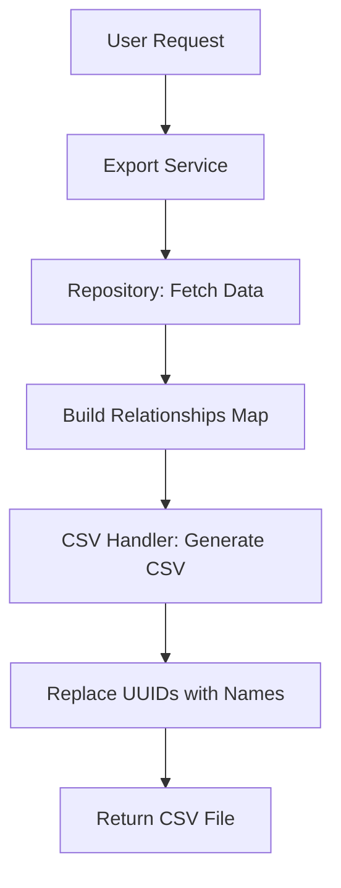
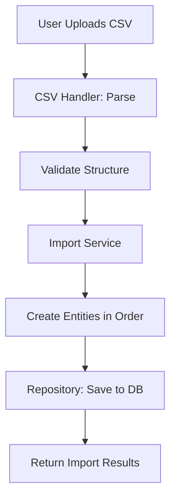

# Data Transfer Domain

## Overview
The Data Transfer domain handles the export and import of financial data in CSV format. It provides users with the ability to backup their data, migrate between systems, or analyze their financial information in external tools.

## Architecture

### Domain Structure
```
app/domains/data_transfer/
├── __init__.py
├── schemas.py       # Pydantic models for API requests/responses
├── service.py       # Business logic for export/import
├── repository.py    # Data access layer
├── router.py        # FastAPI endpoints
└── csv_handler.py   # CSV generation and parsing utilities
```

### Key Components

#### CSV Handler (`csv_handler.py`)
- Manages CSV generation and parsing
- Handles data type conversions
- Provides row validation
- Manages character encoding

#### Service Layer (`service.py`)
- Orchestrates export/import operations
- Manages entity dependencies
- Handles relationship resolution
- Provides progress tracking

#### Repository Layer (`repository.py`)
- Fetches data for export
- Creates entities during import
- Handles duplicate detection
- Manages transactions

## Data Flow

### Export Flow


### Import Flow


## CSV Schema

### Column Naming Convention
All columns use prefix notation to avoid naming conflicts:
- `transaction_*` - Transaction data
- `account_*` - Account information
- `credit_card_*` - Credit card details
- `category_*` - Category information
- `vendor_*` - Vendor/merchant data
- `subscription_*` - Subscription details
- `installment_*` - Installment information
- `broker_*` - Broker/institution data

### Core Columns

#### Transaction Columns
| Column | Type | Description |
|--------|------|-------------|
| transaction_date | Date | Transaction date (YYYY-MM-DD) |
| transaction_amount | Decimal | Transaction amount (positive/negative) |
| transaction_description | String | Transaction description |
| transaction_movement_type | Enum | INCOME/EXPENSE/TRANSFER |
| transaction_is_paid | Boolean | Payment status |
| transaction_ignored | Boolean | Ignored in calculations |

#### Account Columns
| Column | Type | Description |
|--------|------|-------------|
| account_name | String | Account name (unique per broker) |
| account_type | Enum | SAVINGS/CREDIT/CASH/INVESTMENT/OTHER |
| account_currency | String | ISO currency code |
| account_description | String | Optional description |

#### Credit Card Columns
| Column | Type | Description |
|--------|------|-------------|
| credit_card_name | String | Card name (unique per account) |
| credit_card_brand | String | Card brand (Visa, Mastercard, etc.) |
| credit_card_last_four | String | Last 4 digits |
| credit_card_limit | Decimal | Credit limit |
| credit_card_due_date | Integer | Monthly due date (1-31) |

#### Category Columns
| Column | Type | Description |
|--------|------|-------------|
| category_name | String | Category name |
| category_parent | String | Parent category name (if subcategory) |

#### Additional Columns
| Column | Type | Description |
|--------|------|-------------|
| vendor_name | String | Vendor/merchant name |
| vendor_website | String | Vendor website URL |
| broker_name | String | Financial institution name |
| subscription_name | String | Subscription name |
| subscription_amount | Decimal | Recurring amount |
| subscription_billing_cycle | Enum | weekly/monthly/quarterly/yearly |
| installment_plan_name | String | Installment plan name |
| installment_number | Integer | Installment number (1 of N) |
| installment_total_count | Integer | Total installments |

## API Endpoints

### Export Endpoints

#### POST /api/v1/data_transfer/export
Initiates data export for authenticated user.

**Request Body:**
```json
{
  "date_from": "2024-01-01",  // Optional
  "date_to": "2024-12-31",     // Optional
  "include_deleted": false     // Optional, default false
}
```

**Response:**
```json
{
  "export_id": "abc123",
  "status": "completed",
  "file_size": 1048576,
  "row_count": 1500,
  "download_url": "/api/v1/data_transfer/export/abc123/download"
}
```

#### GET /api/v1/data_transfer/export/{export_id}/download
Downloads the generated CSV file.

**Response:** CSV file download

### Import Endpoints

#### POST /api/v1/data_transfer/import
Uploads and processes a CSV file.

**Request:** Multipart form data with CSV file

**Response:**
```json
{
  "import_id": "xyz789",
  "status": "completed",
  "statistics": {
    "total_rows": 1500,
    "imported": 1450,
    "skipped": 50,
    "errors": 0
  },
  "entities_created": {
    "accounts": 5,
    "credit_cards": 3,
    "categories": 25,
    "vendors": 150,
    "transactions": 1200
  }
}
```

#### POST /api/v1/data_transfer/import/validate
Validates CSV structure without importing data.

**Request:** Multipart form data with CSV file

**Response:**
```json
{
  "valid": true,
  "row_count": 1500,
  "warnings": [],
  "errors": []
}
```

## Entity Resolution Strategy

### Name-Based Matching
Entities are matched using unique name combinations:

| Entity | Matching Fields | Example |
|--------|----------------|---------|
| Broker | name | "Chase Bank" |
| Account | name + broker | "Checking" + "Chase Bank" |
| Credit Card | name + account | "Sapphire" + "Credit Cards" |
| Category | name + parent | "Groceries" + "Food & Dining" |
| Vendor | name | "Amazon" |
| Subscription | name + vendor | "Prime" + "Amazon" |

### Import Order
Entities must be created in dependency order:

1. **Brokers** - No dependencies
2. **Accounts** - Depends on Broker
3. **Credit Cards** - Depends on Account
4. **Categories** - Parents before children
5. **Vendors** - No dependencies
6. **Subscriptions** - Depends on Vendor, Category
7. **Installment Plans** - Depends on Vendor, Category, Credit Card
8. **Installments** - Depends on Plan
9. **Transactions** - Depends on all above

## Error Handling

### Export Errors
- User has no data: Return empty CSV with headers
- Database connection issues: Retry with exponential backoff
- Memory issues: Stream large datasets

### Import Errors
- Invalid CSV structure: Return detailed validation errors
- Missing required fields: Report row numbers
- Invalid data types: Provide specific field errors
- Duplicate detection: Skip and report
- Foreign key resolution: Create missing entities or skip

### Error Response Format
```json
{
  "error": "Import validation failed",
  "details": [
    {
      "row": 15,
      "column": "transaction_amount",
      "error": "Invalid decimal format",
      "value": "abc"
    },
    {
      "row": 27,
      "column": "account_name",
      "error": "Required field is empty"
    }
  ]
}
```

## Security Considerations

### File Upload
- Maximum file size: 50MB
- Allowed MIME types: text/csv, application/csv
- Virus scanning (if configured)
- Temporary file cleanup after processing

### Data Validation
- SQL injection prevention via parameterized queries
- CSV injection prevention (sanitize formulas)
- HTML/script sanitization in text fields
- Character encoding validation (UTF-8)

### Access Control
- User can only export their own data
- Import creates data for authenticated user only
- Rate limiting: 10 exports per hour, 5 imports per hour
- Temporary download links expire after 1 hour

## Performance Considerations

### Export Optimization
- Batch fetch related entities
- Use database views for complex joins
- Stream large CSV files
- Implement progress tracking for large exports

### Import Optimization
- Batch create entities (bulk insert)
- Use transactions for atomicity
- Implement chunked processing for large files
- Cache entity lookups during import

### Recommended Limits
- Maximum 100,000 transactions per export
- Maximum 50MB file size for import
- Process imports in 1,000 row chunks
- Timeout after 5 minutes for any operation

## Testing Strategy

### Unit Tests
- CSV generation with various data types
- CSV parsing with edge cases
- Entity resolution logic
- Validation rules

### Integration Tests
- Full export → import cycle
- Error handling scenarios
- Large dataset handling
- Concurrent operations

### Test Data Scenarios
- Empty datasets
- Single entity exports
- Complex relationships
- Maximum size files
- Invalid/corrupted data

## Future Enhancements

### Version 2
- [ ] Multiple file format support (JSON, Excel)
- [ ] Incremental exports (date ranges)
- [ ] Scheduled automatic backups
- [ ] Cloud storage integration (S3, Google Drive)

### Version 3
- [ ] Import conflict resolution UI
- [ ] Data transformation rules
- [ ] Custom field mapping
- [ ] Export templates
- [ ] Audit trail for imports

## Example CSV Output

```csv
transaction_date,transaction_amount,transaction_description,transaction_movement_type,account_name,credit_card_name,category_name,category_parent,vendor_name,broker_name
2024-01-15,-150.00,Grocery Shopping,EXPENSE,Checking Account,,Groceries,Food & Dining,Whole Foods,Chase Bank
2024-01-16,-2500.00,Rent Payment,EXPENSE,Checking Account,,Rent,Housing,Landlord LLC,Chase Bank
2024-01-17,-45.99,Internet Subscription,EXPENSE,,Sapphire Reserve,Internet,Utilities,Comcast,Chase Bank
2024-01-20,3500.00,Salary Deposit,INCOME,Checking Account,,Salary,Income,Employer Inc,Chase Bank
2024-01-22,-500.00,Transfer to Savings,TRANSFER,Checking Account,,Transfers,,Chase Bank
```

## Troubleshooting

### Common Issues

#### Export Issues
- **Empty export**: Check if user has any financial data
- **Slow export**: Consider date range filtering
- **Download fails**: Check temporary file cleanup settings

#### Import Issues
- **All rows skipped**: Check for duplicate data
- **Category import fails**: Ensure parents imported before children
- **Transaction import fails**: Verify all referenced entities exist
- **Character encoding errors**: Ensure CSV is UTF-8 encoded

### Debug Logging
Enable debug logging for detailed operation tracking:
```python
import logging
logging.getLogger("data_transfer").setLevel(logging.DEBUG)
```

## Contact
For issues or questions about the Data Transfer domain, contact the development team.