# 🚀 Fly.io Deployment Guide

## 🎓 Educational Overview

### What We're Implementing:

A complete, end-to-end deployment of our FastAPI application and PostgreSQL database to **Fly.io**. This guide outlines a modern, container-based deployment strategy that is fast, repeatable, and scalable.

### Why Fly.io?

Fly.io offers a superior developer experience with:
- Simple container-based deployments
- Integrated PostgreSQL database
- Generous free tier
- Global edge network
- GitHub Actions integration

### Architecture:

```mermaid
graph TD
    A[User Request] --> B{Fly.io Global Network}
    B --> C[Fly Machine<br/>🐳 FastAPI Container]
    C --> D[(Fly Postgres)]
    E[GitHub Actions] -->|Deploys| C
```



---

## 📋 Deployment Instructions

### Step 1: Install `flyctl` (The Fly CLI)

`flyctl` is the command-line tool for managing your Fly.io apps.

```bash
# macOS / Linux
curl -L https://fly.io/install.sh | sh

# Windows (using PowerShell)
iwr https://fly.io/install.ps1 -useb | iex
```

After installation, add `flyctl` to your PATH. The script will provide the necessary command.

### Step 2: Authenticate and Sign Up

This command will open a browser window for you to sign up or log in. This is where you will need to provide a credit card.

```bash
fly auth login
```

### Step 3: Launch the App on Fly.io

This is a one-time command that scans your source code, generates a `fly.toml` configuration file, and creates a new application on Fly.io. **It will not deploy yet.**

Navigate to the project root and run:

```bash
fly launch
```

Follow the prompts:

- **App Name:** `better-call-buffet` (or accept the generated one)
- **Choose an organization:** Select your personal organization.
- **Choose a region:** Select a region close to you (e.g., `sao paulo (gru)`).
    - Setup a Postgresql database? Yes (select "Development - 1GB")
    - Deploy now? No (we'll configure secrets first)

This will create a `fly.toml` file. This file is your "Infrastructure as Code" for Fly.io.

### Step 4: Configure Secrets

Your application needs the `DATABASE_URL` (which Fly.io created for you) and a `SECRET_KEY`. We'll set these as secrets, which are securely stored environment variables.

```bash
# 1. Fly.io automatically attached the new database, which created a DATABASE_URL secret.
# We don't need to set it manually. You can verify it exists:
fly secrets list

# 2. Set the application's SECRET_KEY
# Generate a new strong secret key:
openssl rand -hex 32

# Set it as a secret (replace YOUR_GENERATED_KEY):
fly secrets set SECRET_KEY="YOUR_GENERATED_KEY"

# 3. Set the environment
fly secrets set ENVIRONMENT="production"
```

### Step 5: Configure Migrations (The Right Way)

We need to run our Alembic database migrations _before_ the new application version goes live. Fly.io has a perfect mechanism for this in `fly.toml`.

Open the newly created `fly.toml` file and add the following `[deploy]` section at the end:

```toml
# fly.toml

# ... (existing content) ...

[deploy]
  release_command = "alembic upgrade head"
```

**Educational Insight:** The `release_command` is executed in a temporary machine after a successful image build but before the new version is deployed to your app's machines. If this command fails, the deployment is aborted, preventing a broken version from going live. This is a critical pattern for robust, zero-downtime deployments.

### Step 6: Deploy the Application

Now that everything is configured, you can deploy your application.

```bash
fly deploy
```

This command will:

1.  Read your `fly.toml`.
2.  Start a remote Docker builder instance.
3.  Build your Docker image on the builder.
4.  Push the image to the Fly.io registry.
5.  Run the `release_command` (our migration).
6.  Provision a Fly Machine and start your application.

### Step 7: Verify the Deployment

```bash
# Check the status of your app and its machines
fly status

# Open your new application in a browser
fly open

# View real-time logs
fly logs
```

You should now have a fully functional application and database running on Fly.io!

---

## 🤖 CI/CD Automation

1. Get Fly API token:
```bash
fly auth token
```

2. Add token to GitHub Secrets (Settings > Secrets > Actions):
   - Name: `FLY_API_TOKEN`
   - Value: [your token]

3. The workflow file is already created at `.github/workflows/fly-deploy.yml`

Now, every push to the `main` branch will automatically test, build, and deploy your application to Fly.io.

---

## 💰 Cost Management

- **Dashboard:** View your usage and resource allocation on your Fly.io dashboard: `fly dashboard`.
- **Scaling:** Your app is running on one machine by default. To stay within the free tier, you can scale the machine count. To stop the app and all charges, you can scale to zero:

  ```bash
  # Check current machine count
  fly scale show

  # Scale to 0 to stop charges (app will be unavailable)
  fly scale count 0

  # Scale back to 1 to start it again
  fly scale count 1
  ```

Congratulations! You have a professional deployment setup on a modern cloud platform.
