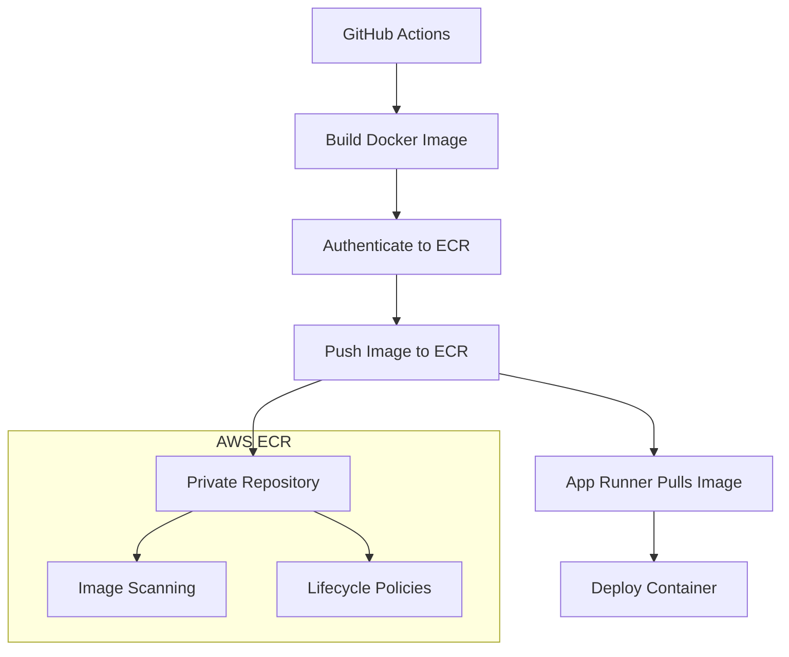

# 🐳 Amazon ECR Setup Guide - Better Call Buffet

## 🎓 Educational Overview

### What is Amazon ECR?

**Amazon Elastic Container Registry (ECR)** is a fully managed Docker container registry service that makes it easy to store, manage, and deploy Docker container images. ECR is integrated with Amazon Elastic Container Service (ECS), Amazon Elastic Kubernetes Service (EKS), and AWS App Runner.

### Why ECR for Financial Applications:

1. **🔒 Security**: Private repositories with fine-grained IAM permissions
2. **🛡️ Scanning**: Automatic vulnerability scanning for container images
3. **🚀 Performance**: High-speed image transfers within AWS network
4. **💰 Cost-Effective**: Pay-per-use pricing with lifecycle policies
5. **🔗 Integration**: Native AWS service integration

## 🏗️ ECR Architecture in Our Pipeline



## 🚀 Method 1: AWS Management Console (Recommended)

### Step 1: Access ECR Service

1. **Login to AWS Console**: https://console.aws.amazon.com/
2. **Navigate to ECR**:
   - Search for "ECR" in the services search
   - Or: Services → Containers → Elastic Container Registry
3. **Select Region**: Choose your deployment region (e.g., `us-east-1`)

### Step 2: Create Repository

1. **Click "Create repository"**

2. **Repository Configuration**:

   ```
   Repository name: better-call-buffet
   Visibility settings: Private
   Image scan settings: ✅ Scan on push
   Encryption settings: AES-256 (default)
   ```

3. **Advanced Settings** (Optional):

   ```
   Image tag mutability: Mutable (allows tag overwriting)
   Lifecycle policy: (Set up later for automated cleanup)
   ```

4. **Click "Create repository"**

### Step 3: Repository Information

After creation, note these critical values:

```bash
# Repository Details
Repository URI: [ACCOUNT-ID].dkr.ecr.[REGION].amazonaws.com/better-call-buffet
Registry URI: [ACCOUNT-ID].dkr.ecr.[REGION].amazonaws.com
AWS Account ID: [ACCOUNT-ID]
Region: [REGION]
```

**Example:**

```
Repository URI: 123456789012.dkr.ecr.us-east-1.amazonaws.com/better-call-buffet
Registry URI: 123456789012.dkr.ecr.us-east-1.amazonaws.com
```

## 🖥️ Method 2: AWS CLI

If you prefer command-line interface:

### Prerequisites

```bash
# Install AWS CLI v2
# Windows: Download from https://aws.amazon.com/cli/
# macOS: brew install awscli
# Linux: See AWS documentation

# Configure AWS CLI
aws configure
# Enter: Access Key ID, Secret Access Key, Region, Output format
```

### Create Repository via CLI

```bash
# Create ECR repository
aws ecr create-repository \
    --repository-name better-call-buffet \
    --image-scanning-configuration scanOnPush=true \
    --region us-east-1

# Expected output:
{
    "repository": {
        "repositoryArn": "arn:aws:ecr:us-east-1:123456789012:repository/better-call-buffet",
        "registryId": "123456789012",
        "repositoryName": "better-call-buffet",
        "repositoryUri": "123456789012.dkr.ecr.us-east-1.amazonaws.com/better-call-buffet"
    }
}
```

## 🔧 GitHub Secrets Configuration

After creating your ECR repository, update your GitHub secrets:

### Required Secret Update

Go to GitHub → Settings → Secrets and variables → Actions:

```
Secret Name: ECR_REGISTRY
Secret Value: [ACCOUNT-ID].dkr.ecr.[REGION].amazonaws.com
```

**Example:**

```
ECR_REGISTRY: 123456789012.dkr.ecr.us-east-1.amazonaws.com
```

## 🛡️ IAM Permissions for ECR

Your AWS IAM user needs these ECR permissions:

### Minimal ECR Policy

```json
{
  "Version": "2012-10-17",
  "Statement": [
    {
      "Effect": "Allow",
      "Action": [
        "ecr:GetAuthorizationToken",
        "ecr:BatchCheckLayerAvailability",
        "ecr:GetDownloadUrlForLayer",
        "ecr:BatchGetImage",
        "ecr:DescribeRepositories",
        "ecr:GetRepositoryPolicy",
        "ecr:ListImages",
        "ecr:DescribeImages",
        "ecr:BatchGetImage",
        "ecr:InitiateLayerUpload",
        "ecr:UploadLayerPart",
        "ecr:CompleteLayerUpload",
        "ecr:PutImage"
      ],
      "Resource": "*"
    }
  ]
}
```

### Attach Policy to User

1. **Go to IAM Console** → Users → Your CI/CD User
2. **Click "Add permissions"** → "Attach existing policies directly"
3. **Search for "AmazonEC2ContainerRegistryPowerUser"** (pre-built policy)
4. **Or create custom policy** with the JSON above

## 🔄 Testing ECR Integration

### Test Docker Push/Pull Locally

```bash
# 1. Get login token
aws ecr get-login-password --region us-east-1 | docker login --username AWS --password-stdin 123456789012.dkr.ecr.us-east-1.amazonaws.com

# 2. Build your image
docker build -t better-call-buffet .

# 3. Tag for ECR
docker tag better-call-buffet:latest 123456789012.dkr.ecr.us-east-1.amazonaws.com/better-call-buffet:latest

# 4. Push to ECR
docker push 123456789012.dkr.ecr.us-east-1.amazonaws.com/better-call-buffet:latest

# 5. Verify in AWS Console
# Go to ECR → better-call-buffet → Images
```

## 📊 CI/CD Pipeline Integration

Your GitHub Actions workflow will now:

1. **Build Docker Image**: Create container from your FastAPI app
2. **Authenticate to ECR**: Use AWS credentials from GitHub Secrets
3. **Push to ECR**: Store image in your private repository
4. **Deploy via App Runner**: Pull image from ECR for deployment

### Updated Pipeline Flow

```yaml
# This is already in your .github/workflows/ci.yml
- name: 🔐 Configure AWS Credentials
  uses: aws-actions/configure-aws-credentials@v4
  with:
    aws-access-key-id: ${{ secrets.AWS_ACCESS_KEY_ID }}
    aws-secret-access-key: ${{ secrets.AWS_SECRET_ACCESS_KEY }}
    aws-region: ${{ secrets.AWS_REGION }}

# ECR login and push would be added here
- name: 🐳 Login to Amazon ECR
  run: |
    aws ecr get-login-password --region ${{ secrets.AWS_REGION }} | \
    docker login --username AWS --password-stdin ${{ secrets.ECR_REGISTRY }}

- name: 🚀 Build and Push to ECR
  run: |
    docker build -t better-call-buffet .
    docker tag better-call-buffet:latest ${{ secrets.ECR_REGISTRY }}/better-call-buffet:latest
    docker push ${{ secrets.ECR_REGISTRY }}/better-call-buffet:latest
```

## 🔧 Lifecycle Policies (Recommended)

Set up automatic cleanup to control costs:

### Example Lifecycle Policy

```json
{
  "rules": [
    {
      "rulePriority": 1,
      "description": "Keep only 10 most recent images",
      "selection": {
        "tagStatus": "any",
        "countType": "imageCountMoreThan",
        "countNumber": 10
      },
      "action": {
        "type": "expire"
      }
    },
    {
      "rulePriority": 2,
      "description": "Delete untagged images older than 1 day",
      "selection": {
        "tagStatus": "untagged",
        "countType": "sinceImagePushed",
        "countUnit": "days",
        "countNumber": 1
      },
      "action": {
        "type": "expire"
      }
    }
  ]
}
```

### Apply Lifecycle Policy

1. **Go to ECR Console** → Your Repository
2. **Click "Lifecycle Policy"** tab
3. **Click "Create rule"**
4. **Copy the JSON above** or use the visual editor

## 🐛 Common Issues & Solutions

### Issue 1: Authentication Failed

```bash
Error: denied: User [arn] is not authorized to perform: ecr:BatchCheckLayerAvailability
```

**Solution**: Check IAM permissions and ensure ECR policies are attached.

### Issue 2: Repository Not Found

```bash
Error: repository better-call-buffet not found
```

**Solution**: Verify repository name and region in your commands.

### Issue 3: Image Push Failed

```bash
Error: denied: requested access to the resource is denied
```

**Solution**: Ensure you're authenticated with `aws ecr get-login-password`.

## ✅ Verification Checklist

After ECR setup:

- [ ] ECR repository created: `better-call-buffet`
- [ ] Repository is private
- [ ] Scan on push is enabled
- [ ] GitHub secret `ECR_REGISTRY` is updated
- [ ] IAM permissions are configured
- [ ] Can authenticate to ECR locally
- [ ] Test image push works

## 🎯 Next Steps

1. **Complete App Runner Setup**: Create App Runner service
2. **Update CI/CD Pipeline**: Add ECR push steps to GitHub Actions
3. **Test End-to-End Deployment**: Push code and verify full pipeline

## 🔗 Related AWS Services

- **AWS App Runner**: Will pull images from this ECR repository
- **AWS CloudWatch**: Monitor ECR usage and access logs
- **AWS IAM**: Manage access permissions to ECR repositories
- **AWS CloudFormation**: Infrastructure as Code for ECR (advanced)

---

**💡 Educational Insight**: ECR is the foundation of containerized deployments in AWS. Understanding container registries prepares you for advanced concepts like microservices architecture, Kubernetes deployments, and cloud-native development patterns.
