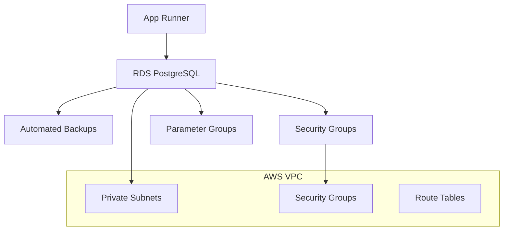

# 🗄️ Production Database Setup Guide - Better Call Buffet

## 🎓 Educational Overview

### What We're Implementing:

Setting up a production-grade PostgreSQL database using AWS RDS for your FastAPI financial tracking application.

### Why AWS RDS for Financial Applications:

1. **🔒 Security**: Encryption at rest and in transit, network isolation
2. **📊 Reliability**: Automated backups, Multi-AZ deployments, 99.95% uptime SLA
3. **🔧 Maintenance**: Automated patching, monitoring, and scaling
4. **💰 Cost-Effective**: Pay-as-you-go pricing with reserved instance options
5. **🛡️ Compliance**: SOC, PCI DSS, and other compliance certifications

### Before vs After:

**Before:**

- ❌ No production database
- ❌ CI/CD pipeline fails at deployment
- ❌ No secure data storage for financial records
- ❌ No backup or disaster recovery

**After:**

- ✅ Production-ready PostgreSQL database
- ✅ Automated backups and point-in-time recovery
- ✅ Secure network isolation and encryption
- ✅ Full CI/CD pipeline functionality

## 🏗️ Database Architecture



## 🚀 Method 1: AWS Management Console (Recommended)

### Step 1: Access RDS Console

1. **Login to AWS Console**: https://console.aws.amazon.com/
2. **Navigate to RDS**: Search for "RDS" or Services → Database → RDS
3. **Select Region**: Ensure you're in the same region as your other resources (e.g., `us-east-1`)

### Step 2: Create Database

1. **Click "Create database"**
2. **Choose Database Creation Method**: Standard create
3. **Engine Options**:
   ```
   Engine type: PostgreSQL
   Version: PostgreSQL 15.4-R2 (or latest)
   ```

### Step 3: Templates and Settings

1. **Templates**: Choose **"Production"** for production-grade configuration
2. **Settings**:
   ```
   DB instance identifier: better-call-buffet-prod-db
   Master username: bcb_admin
   Master password: [Generate secure password - save this!]
   ```

### Step 4: Instance Configuration

1. **DB Instance Class**:

   ```
   Instance type: db.t3.micro (for development/testing)
   OR
   Instance type: db.t3.small (for production)
   ```

2. **Storage**:
   ```
   Storage type: General Purpose SSD (gp3)
   Allocated storage: 20 GB (minimum)
   Enable storage autoscaling: Yes
   Maximum storage threshold: 100 GB
   ```

### Step 5: Connectivity

1. **Compute Resource**: Don't connect to an EC2 compute resource
2. **Network Type**: IPv4
3. **Virtual Private Cloud (VPC)**: Default VPC
4. **DB Subnet Group**: default
5. **Public Access**: **No** (for security)
6. **VPC Security Groups**: Create new
   - **Security group name**: `better-call-buffet-db-sg`
7. **Availability Zone**: No preference
8. **Database Port**: 5432

### Step 6: Database Authentication

1. **Database Authentication**: Password authentication
2. **Monitoring**: Enable Enhanced monitoring (optional)
3. **Additional Configuration**:
   ```
   Initial database name: better_call_buffet_prod
   Backup retention period: 7 days
   Backup window: Default
   Maintenance window: Default
   ```

### Step 7: Create Database

1. **Review all settings**
2. **Click "Create database"**
3. **Wait 10-15 minutes for creation**

## 📊 Database Monitoring

### CloudWatch Metrics

AWS RDS automatically provides these metrics:

- **DatabaseConnections**: Number of active connections
- **CPUUtilization**: Database CPU usage
- **FreeStorageSpace**: Available storage
- **ReadLatency/WriteLatency**: Query performance

### Set Up Alarms

```bash
# Create CloudWatch alarm for high CPU
aws cloudwatch put-metric-alarm \
    --alarm-name "RDS-HighCPU-better-call-buffet" \
    --alarm-description "High CPU usage on production database" \
    --metric-name CPUUtilization \
    --namespace AWS/RDS \
    --statistic Average \
    --period 300 \
    --threshold 80 \
    --comparison-operator GreaterThanThreshold \
    --dimensions Name=DBInstanceIdentifier,Value=better-call-buffet-prod-db \
    --evaluation-periods 2
```

## 🔄 Database Maintenance

### Automated Backups

- **Backup Window**: During low-traffic hours
- **Retention**: 7 days (configurable up to 35 days)
- **Point-in-Time Recovery**: Available for entire retention period

### Manual Snapshots

```bash
# Create manual snapshot
aws rds create-db-snapshot \
    --db-instance-identifier better-call-buffet-prod-db \
    --db-snapshot-identifier better-call-buffet-prod-snapshot-$(date +%Y%m%d)
```

## 🐛 Common Issues & Solutions

### Issue 1: Connection Timeout

```
Error: connection to server at "host" failed: Connection timed out
```

**Solutions:**

1. Check security group allows port 5432
2. Verify RDS instance is in "Available" state
3. Ensure correct VPC and subnet configuration

### Issue 2: Authentication Failed

```
Error: password authentication failed for user "bcb_admin"
```

**Solutions:**

1. Verify username and password are correct
2. Check if master user password was set properly
3. Try resetting the master user password

### Issue 3: Database Does Not Exist

```
Error: database "better_call_buffet_prod" does not exist
```

**Solutions:**

1. Verify initial database name was set during creation
2. Create database manually: `CREATE DATABASE better_call_buffet_prod;`
3. Check database name in connection string

## 💰 Cost Optimization

### Development/Testing Setup

```
Instance: db.t3.micro
Storage: 20 GB gp3
Estimated cost: ~$15-20/month
```

### Production Setup

```
Instance: db.t3.small or db.t3.medium
Storage: 100 GB gp3 with autoscaling
Multi-AZ: Yes (for high availability)
Estimated cost: ~$30-60/month
```

### Cost-Saving Tips

1. **Reserved Instances**: Save up to 60% with 1-3 year commitments
2. **Storage Optimization**: Use gp3 instead of gp2 for better performance/cost
3. **Backup Management**: Adjust retention period based on needs
4. **Monitoring**: Set up billing alerts for unexpected costs

## ✅ Verification Checklist

After database setup:

- [ ] RDS instance is in "Available" state
- [ ] Security group allows port 5432 access
- [ ] Database connection string is correct
- [ ] `PROD_DATABASE_URL` secret is updated in GitHub
- [ ] Local connection test successful
- [ ] Database migrations applied successfully
- [ ] Database schema verified
- [ ] CloudWatch monitoring enabled

## 🎯 Next Steps

1. **Test CI/CD Pipeline**: Push code to trigger deployment
2. **Monitor Database Performance**: Check CloudWatch metrics
3. **Set Up Alerting**: Configure alarms for key metrics
4. **Plan Backup Strategy**: Schedule regular manual snapshots
5. **Security Review**: Restrict security group access after testing

## 🔗 Related Documentation

- [Database Migrations Guide](./database-migrations-guide.md)
- [Database Access with DBeaver](./database-access-with-dbeaver.md)
- [Deploying and Seeding Production DB](./deploying-and-seeding-production-db.md)

---

**💡 Educational Insight**: Production database setup is a critical foundation for any financial application. Understanding RDS configuration, security groups, and backup strategies prepares you for managing enterprise-grade database systems and ensuring data integrity in production environments.
