# Railway CI/CD Setup Guide

This guide covers the complete setup of Railway's CI/CD pipeline with GitHub Actions for the Better Call Buffet project.

## 🎯 Overview

Our CI/CD pipeline combines Railway's native GitHub integration with GitHub Actions for comprehensive quality gates:

- **GitHub Actions**: Security scanning, testing, and migration validation
- **Railway**: Automatic deployment after successful GitHub Actions
- **Quality Gates**: All tests must pass before deployment proceeds

## 📋 Prerequisites

1. **Railway Account**: Signed up at [railway.app](https://railway.app)
2. **GitHub Repository**: Connected to Railway
3. **PostgreSQL Database**: Provisioned on Railway
4. **Project Tokens**: Created for CI/CD access

## 🚀 Setup Instructions

### Step 1: Railway Project Configuration

1. **Create Railway Project**
   - Go to Railway dashboard
   - Create new project
   - Add PostgreSQL database service

2. **Connect GitHub Repository**
   - Add service from GitHub repo
   - Select `better-call-buffet` repository
   - Choose `main` branch for deployments
   - **Important**: Enable "Wait for CI" in service settings

3. **Environment Variables**
   ```
   ENVIRONMENT=production
   DEBUG=false
   SECRET_KEY=your-super-secure-secret-key
   BACKEND_CORS_ORIGINS=["https://yourdomain.railway.app"]
   SENTRY_DSN=your-sentry-dsn
   ENABLE_PERFORMANCE_LOGGING=true
   ```
   Note: `DATABASE_URL` is automatically provided by Railway

### Step 2: GitHub Secrets Configuration

Add these secrets to your GitHub repository (Settings → Secrets and variables → Actions):

```
RAILWAY_TOKEN=your-railway-project-token
RAILWAY_SERVICE_ID=your-service-id
RAILWAY_HEALTH_URL=https://your-app.railway.app/health
```

**Getting Railway Token:**
1. Go to Railway dashboard
2. Navigate to Project Settings
3. Create new Project Token
4. Copy the token (starts with `railway-`)

**Getting Service ID:**
1. Go to your Railway service
2. Click on Settings tab
3. Copy the Service ID from the URL or settings

### Step 3: Verify GitHub Actions Workflow

The workflow is located at `.github/workflows/deploy.yml` and includes:

**Test Job (runs on all pushes/PRs):**
- Security scanning with Safety and pip-audit
- Migration validation with Alembic
- Test execution with pytest

**Deploy Job (main branch only):**
- Deploys to Railway using CLI
- Performs health checks
- Provides deployment status

### Step 4: Database Migration Setup

Migrations run automatically during Railway deployment. The process:

1. Railway builds Docker image
2. Runs `./scripts/run-migrations.sh` during build
3. Starts application with `./scripts/run-prod.sh`

## 🔄 Deployment Flow

```mermaid
flowchart TD
    A[Push to main] --> B[GitHub Actions]
    B --> C{Security & Tests Pass?}
    C -->|No| D[❌ Block Deployment]
    C -->|Yes| E[✅ Trigger Railway]
    E --> F[Railway Build]
    F --> G[Run Migrations]
    G --> H[Deploy App]
    H --> I[Health Check]
    I --> J[🎉 Live Application]
```



## 📊 Pipeline Features

### Quality Gates
- **Security**: Dependency vulnerability scanning
- **Testing**: Automated test execution
- **Migration**: Database schema validation
- **Health**: Post-deployment health verification

### Automatic Triggers
- **Main Branch**: Full CI/CD pipeline with deployment
- **Pull Requests**: Testing and validation only
- **Manual**: Workflow dispatch for emergency deployments

### Notifications
- Pipeline status in GitHub Actions
- Deployment notifications in workflow logs
- Railway dashboard deployment tracking

## 🔧 Troubleshooting

### Common Issues

**1. Migration Failures**
```bash
# Check migration status
railway run alembic current
railway run alembic history
```

**2. Health Check Failures**
- Verify health endpoint URL in secrets
- Check Railway app logs
- Ensure app starts properly

**3. Authentication Issues**
- Verify `RAILWAY_TOKEN` secret is valid
- Check token permissions in Railway dashboard
- Ensure service ID is correct

### Useful Commands

```bash
# Deploy manually
railway up

# Check logs
railway logs

# Run migrations manually
railway run ./scripts/run-migrations.sh

# Check service status
railway status
```

## 📈 Monitoring

### Railway Dashboard
- Real-time deployment status
- Application logs and metrics
- Resource usage monitoring

### GitHub Actions
- Pipeline execution history
- Test results and coverage
- Security scan reports

### Health Monitoring
- Automatic health checks post-deployment
- Endpoint monitoring via workflow
- Application status verification

## 🔐 Security Best Practices

1. **Token Management**
   - Use project tokens (not personal tokens)
   - Rotate tokens regularly
   - Store securely in GitHub secrets

2. **Environment Variables**
   - Never commit secrets to repository
   - Use Railway environment variables
   - Separate development/production configs

3. **Access Control**
   - Limit Railway project access
   - Use branch protection rules
   - Review deployment permissions

## 📚 Additional Resources

- [Railway Documentation](https://docs.railway.com)
- [GitHub Actions Documentation](https://docs.github.com/en/actions)
- [Railway CLI Reference](https://docs.railway.com/guides/cli)
- [Project RAILWAY_DEPLOYMENT_GUIDE.md](../../RAILWAY_DEPLOYMENT_GUIDE.md)